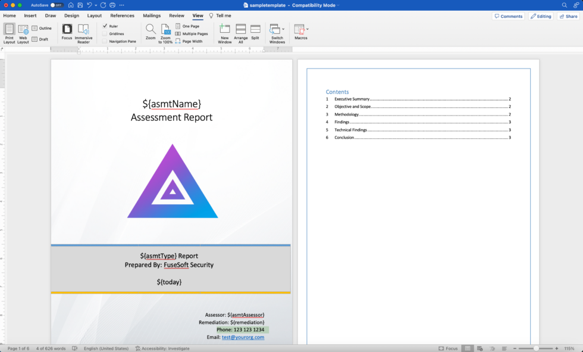
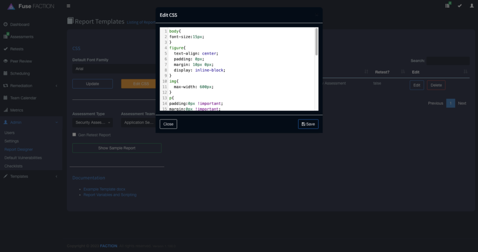
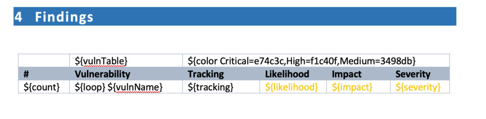
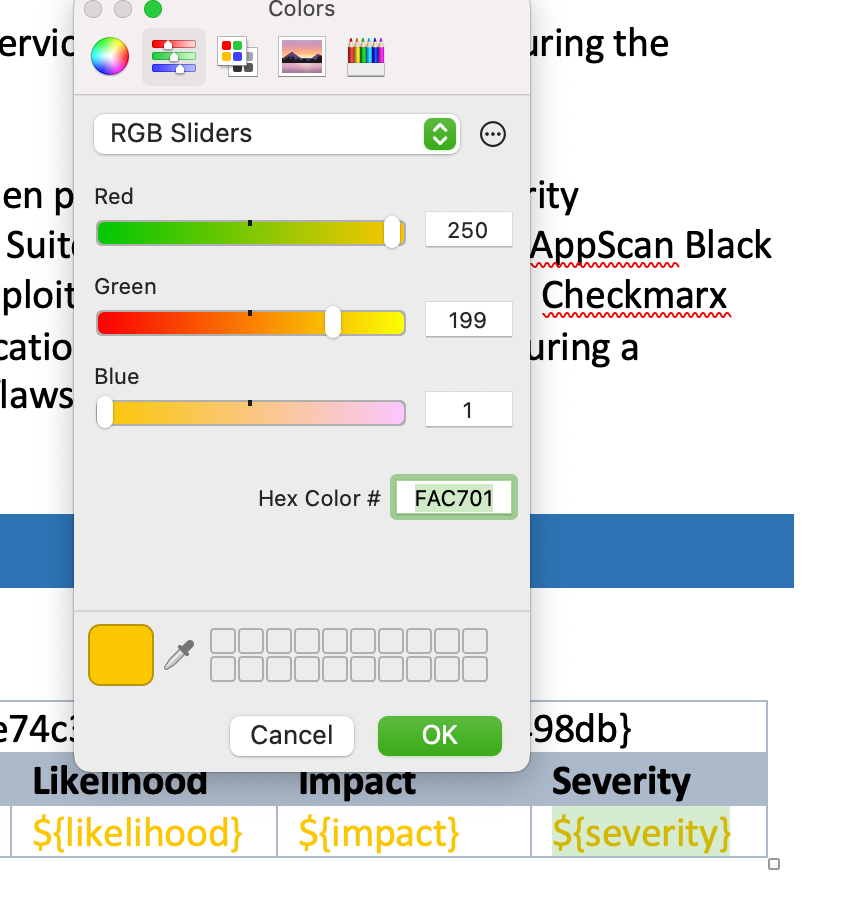
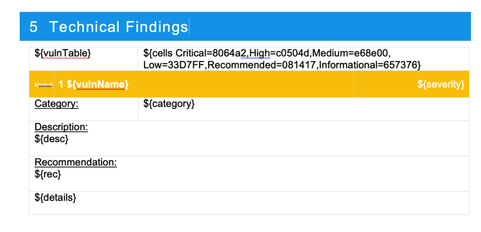
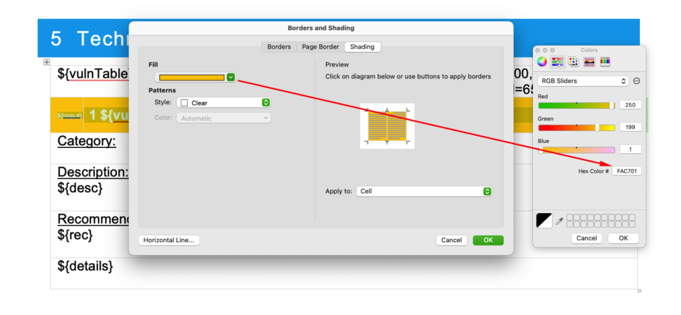
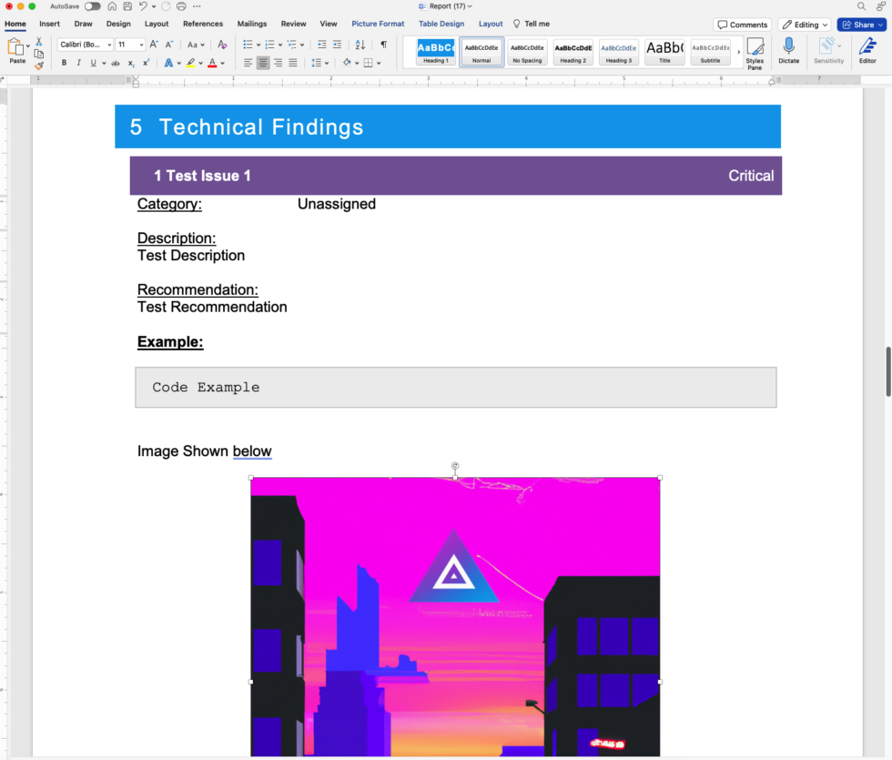

The Faction Report Designer allows you to create custom security report templates for each assessment type. When building reports you need to use the variables listed below. Entering these into your DOCX reports will auto-replace assessment and vulnerability text when the report is generated. You can even use the same variables in many of the assessor input fields outside of the report template (like Risk Assessment Summaries) and it will auto-populate the fields when the report is generated.

You can download the sample templates here:
 [Sample Templates](https://github.com/factionsecurity/report_templates) 
 
## GENERAL VARIABLES:

All of these variables can be used anywhere in the DOCX template. Those with a star ⭐️ can be used in the web interface to assist in creating common reusable templates.

- **${TOC}** – Placeholder for the Table of Contents
- **${summary1}** – The high level summary
- **${summary2}** – The objective and scope
- **${asmtId}** – Internal Database ID ⭐️
- **${asmtAppid}** – The assigned Application ID ⭐️
- **${asmtName}** – The Assessment Name ⭐️
- **${asmtAssessor}** – The first assessor assigned to the assessment ⭐️
- **${asmtAssessor_Email}** – The first assessor email address ⭐️
- **${asmtAssessors_Lines}** – All Assessors split into lines ⭐️
- **${asmtAssessors_Comma}** – All Assessors split into a comma delimited list ⭐️
- **${asmtAssessor_Bullets}** – All Assessors split into a bulleted list ⭐️
- **${remediation}** – The Remediation Person assigned to the assessment ⭐️
- **${riskCount*}** – The number of findings at the RiskLevel 0-9 ⭐️
- **${riskTotal}** – The total number of findings at all RiskLevels ⭐️
- **${asmtTeam}** – The Assessor Team Name ⭐️
- **${asmtType}** – The Type of the Assessment ⭐️
- **${asmtStart}** – The Start date of the assessment ⭐️
- **${asmtEnd}** – The End date of the assessment ⭐️
- **${asmtAccessKey}** – Guid to access the client retest queue. ⭐️
- **${today}** – Day the report is generated ⭐️
- **${cfXXXXXX}** – Custom Fields are ones you specify in the admin interface. These are all prefixed with “cf” ⭐️

## VULNERABILITY TABLES VARIABLES:

These are only available inside tables.

- **${vulnTable}** – This defines a table to be a vulnerability listing table.
- **${vulnName}** – The Vulnerability name
- **${rec}** – Vulnerability Recommendation
- **${desc}** – Vulnerability Description
- **${category}** – Category of the vulnerability
- **${severity}** – Severity of each vulnerability.
- **${likelihood}** – Likelihood of the vulnerability
- **${impact}** – Impact of the vulnerability
- **${cvssScore}** – CVSS score of the vulnerability
- **${cvssString}** – CVSS vector of the vulnerability
- **${count}** – Row Count of the vulnerability
- **${tracking}** – Tracking number of the vulnerability
- **${vid}** – Vulnerability internal database id
- **${cfXXXXXX}** – Custom Fields are ones you specify in the admin interface. These are all prefixed with “cf”
- **${color  key=value,key=value}** – The color of the text is based on key-value pairs. [See below for how to set up colors.](https://docs.factionsecurity.com/Custom%20Security%20Report%20Templates/#setting-severity-colors)
- **${cells key=value,key=value}** – The color of the table cell is based on key-value pairs.  [See below for how to set up colors.](https://docs.factionsecurity.com/Custom%20Security%20Report%20Templates/#setting-severity-colors)
- **${loop}** – This variable tells the report generator which row will be repeated.
- **${loop-*}** – This allows multiple rows to be repeated. Example ${loop-1} will repeat the row but the one below it.
- **${details}** – This will insert screenshots and exploit steps for each vulnerability.
  
### Example Table Summary Table

|   |   |   |   |
|---|---|---|---|
|${vulnTable}|${color Critical=C00000,High=FFC000}|||
|ID|Finding Name|Impact|Severity|
|${loop}|${count}. ${vulnName}|${impact}|${severity}|

### Example Table Detail Table

|   |   |   |   |
|---|---|---|---|
|${vulnTable}|   |${cells Critical=8064a2,High=c0504d,Medium=e68e00, Low=33D7FF,Recommended=081417,Informational=657376}|   |
|${loop-5}|## 1  ${vulnName}|   |${severity}|
|CVSS:|   |${cvssString}|${cvssScore}|
|Category:|   |${category}|   |
|Description:  ${desc}|   |   |   |
|Recommendation:  ${rec}|   |   |   |
|${details}|   |   |   |

**Why is the heading yellow?!?! Check [here](/Custom%20Security%20Report%20Templates/#setting-severity-colors)

## VULNERABILITY BLOCK VARIABLES:  
**For when you do not want to use tables to display your vulnerability information. You can use the following variables for inserting vulnerability information outside of a table**

- **${fiBegin} / ${fiEnd}** – Block to repeat against all findings.
- **${vulnName}** – The Vulnerability name
- **${rec}** – Vulnerability Recommendation
- **${desc}** – Vulnerability Description
- **${category}** – Category of the vulnerability
- **${severity}** – Severity of each vulnerability.
- **${likelihood}** – Likelihood of the vulnerability
- **${impact}** – Impact of the vulnerability
- **${cvssScore}** – CVSS score of the vulnerability
- **${cvssString}** – CVSS vector of the vulnerability
- **${count}** – Row Count of the vulnerability
- **${tracking}** – Tracking number of the vulnerability
- **${vid}** – Vulnerability internal database id
- **${cfXXXXXX}** – Custom Fields are ones you specify in the admin interface. These are all prefixed with “cf”
- **${details}** – This will insert screenshots and exploit steps for each vulnerability.
- **${color  key=value,key=value}** – The color of the text is based on key-value pairs. [See below for how to set up colors.](https://docs.factionsecurity.com/Custom%20Security%20Report%20Templates/#setting-severity-colors)
- **${fill key=value,key=value}** – The color of the background elements is based on key-value pairs.  [See below for how to set up colors.](https://docs.factionsecurity.com/Custom%20Security%20Report%20Templates/#setting-severity-colors)

### Example Block Findings

**Why is the heading yellow?!?! Check [here](/Custom%20Security%20Report%20Templates/#setting-severity-colors)

## CSS FORMATTING:

All of the text generated from Faction is HTML. You can control how it is rendered in the DOCX format using the CSS editor in the Report Designer. You will need to set the CSS to match your report templates. Things like font and size will need to match. Images will need to be forced to resize to the correct dimensions to fit in your reports.

## SETTING SEVERITY COLORS:

When building reports you most likely will set the text or cell to the color that matches the severity of the finding. To achieve this in FACTION you need to set a default color in the docx template that matches the severity category (i.e. Overall, Likelihood, and Impact). These default colors are in the table below:

|   |   |
|---|---|
|**Category**|**Color Hex**|
|Overall Severity|#FAC701|
|Likelihood|#FAC702|
|Impact|#FAC703|

For Example, a table in MS Word below has pre-filled the color codes for each severity name and category.

Right-click the overall severity variable, **${severity}**; you can see the default hex code for this color is #FAC701. Likelihood would be set to #FAC02, and Impact would be set to #FAC703.

Setting the background color for cells works in much the same way. Notice we use the ${cells} variable instead.

Right-click on the cell and set the color you may only want to use the Overall severity option but you can have multiple cells with each category if you wish.

Below is an example of the generated report table with colors replaced.

