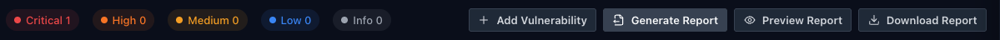
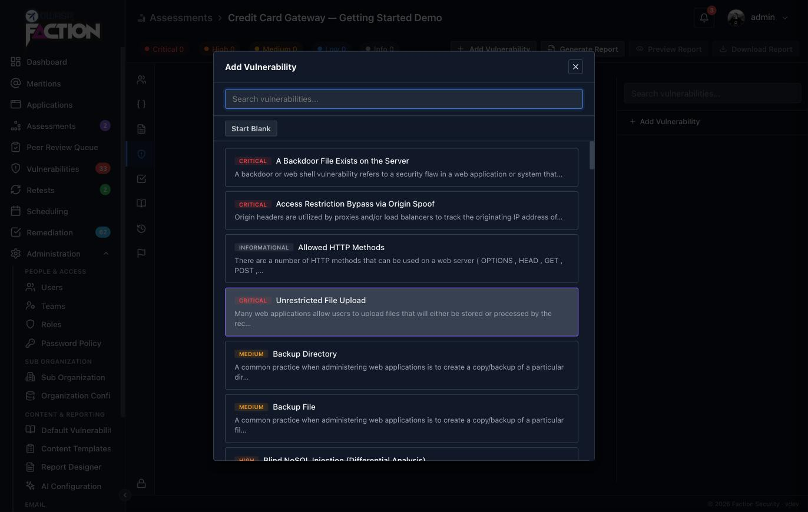
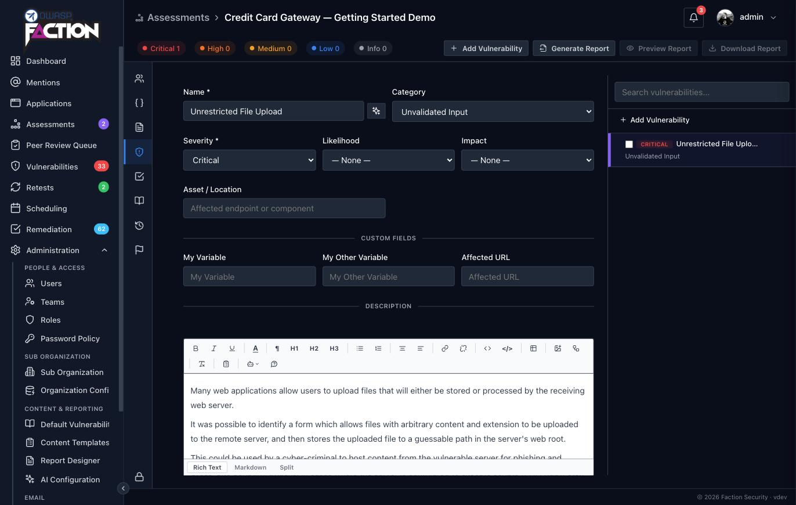
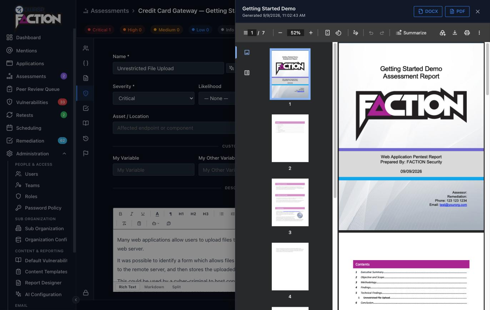

# Add findings and generate the report

With the assessment [scheduled](schedule-assessment.md), the rest of the work happens on the assessment page. Open **Assessments** in the sidebar and click the assessment you created.

The assessment page has a strip of tabs down its left edge: assessment info, variables, executive summary, vulnerabilities, checklists, notebook, history and finalize. The report actions sit in the bar across the top.

## 1. Add a vulnerability

Click the shield icon to open the **Vulnerabilities** tab, then **Add Vulnerability**. Faction opens its vulnerability library, a searchable list of write-ups that ships with the product, each with a severity, description and recommendation already written.

Pick one, for example **Unrestricted File Upload**, or click **Start Blank** to write a finding from scratch. Either way the finding opens in the editor:

The finding is saved as soon as it is created and every edit saves automatically. The fields that matter for the report:

- **Name**, **Severity** and **Category** drive the summary tables and the severity coloring in the report.
- **Asset / Location** is where the issue was found, a URL, host or path.
- **Description**, **Recommendation** and **Details** are the body of the finding. Details is where screenshots and reproduction steps go; paste images straight into the editor.
- **Custom Fields** are the extra inputs your report template asks for. The default template has none you need to fill in.

Add as many findings as you like. The severity counts in the top bar update as you go.

!!! tip "Your own vulnerability library"
    The library is editable under **Admin → Content & Reporting → Default Vulnerabilities**, so the write-ups your team reuses can be added once and picked from here every time.

## 2. Generate the report

Click **Generate Report** in the top bar. Faction takes the assessment's report template, fills in the assessment details, repeats the findings section for every vulnerability and produces the report as DOCX and PDF. Generation runs in the background; a toast says **Report ready for download** when it is done, typically within a few seconds.

The **Finalize** tab, the flag icon at the bottom of the tab strip, keeps the generated documents under **Report Documents**, with a download link for each and the time it was last generated. Generate again whenever the findings change; each run replaces the last.

## 3. Preview it

Click **Preview Report** to read the PDF without leaving Faction:

The preview drawer has **DOCX** and **PDF** buttons at the top for downloading either format. **Download Report** in the top bar does the same for the DOCX.

What you are looking at is the default template: a cover page, table of contents, executive summary, methodology, a findings summary and one detail section per vulnerability. The severity colors, the summary table and the per-finding layout all come from the template.

## Where to go next

- **Make the report yours.** [Using DOCX Report Templates](../reporting/docx-templates.md) covers the variables the template uses, how findings are laid out, and, at the end, [how to upload your own template](../reporting/docx-templates.md#uploading-your-template) in place of the default.
- **Ask for more on each finding.** [User Defined Fields](../reporting/user-defined-fields.md) adds inputs such as an affected URL or a CWE number to the finding form and prints them in the report.
- **Standardise the testing.** [Assessment Checklists](../reporting/checklists.md) enforces a checklist per assessment type and can print it in the report.
