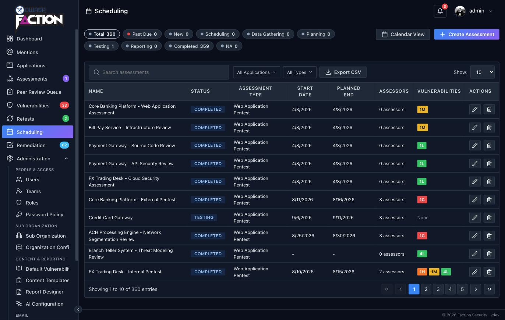

# Schedule an assessment

Every engagement in Faction starts as an assessment. An assessment ties an application, an assessment type, a date range, an assessor team and a report template together, and everything else, findings, checklists, peer review and the generated report, hangs off it.

## 1. Open Scheduling

Click **Scheduling** in the sidebar. This is the planning view: every assessment with its status, dates, assessors and finding counts, plus a calendar view if you prefer to see the engagements laid out by week.

Click **Create Assessment** in the top right.

## 2. Fill in the basics

| Field | What to enter |
|---|---|
| **Application Name** | Start typing to search the applications already in Faction, or type a new name to create one on the spot. The application is what the assessment is testing |
| **Assessment Name** | Faction pre-fills it from the application name. Change it to something you will recognise in a list, such as `Getting Started Demo` |
| **Assessment Type** | The kind of engagement, for example **Web Application Pentest**. The type decides which report templates and checklists apply |
| **Start Date** and **Planned End Date** | Pick a start date; the end date follows from the duration you choose. The calendar preview on the right shows the engagement against everything else scheduled |
| **Status** | Leave it at **New** |

## 3. Confirm the report template

Once the assessment type is chosen, the **Report Template** section fills itself in. On a fresh install there is exactly one template for Web Application Pentest, so Faction selects it for you and says so.

!!! info "This is the default template"
    The template you see here, **Web Assessment Report**, is the [default Faction pentest template](https://github.com/factionsecurity/report_templates) that a new install downloads on first start. It gives you a complete, professional report out of the box, and it is the template this walkthrough uses. Nothing about it is fixed: [Using DOCX Report Templates](../reporting/docx-templates.md) explains how to design your own, and [User Defined Fields](../reporting/user-defined-fields.md) how to add your own inputs to it.

## 4. Confirm your assessment contacts and scope

Further down the form you can add contacts, assessors, stakeholders and scope. None of them are required for a first run, but the assessors are worth setting now so the engagement shows up on the right people's calendars.

The **Assessors** list checks the dates you picked against everyone else's schedule. Each assessor is marked **Free** or **Busy** for that window, so you can see at a glance who has capacity and avoid overloading the team.

The last part of the form is **Scope**. This is the briefing for the assessors: test credentials, what is in and out of scope, and anything else the team needs to know before they start. It is a rich text editor, so tables, lists and emphasis all work. Below it, **Engagement URLs** lists the environments under test.

If you would rather not put credentials in the editor, or you have supporting material such as a network diagram, a spreadsheet of network ranges or an encrypted archive, attach it under **Files**. Anything added here is shared with the assessors on the assessment.

## 5. Save

Click **Save & Close**. The assessment appears at the top of the Scheduling list with the status **New**, and under **Assessments** in the sidebar, which is where the day-to-day work happens.

Next: [Add findings and generate the report](first-report.md).
