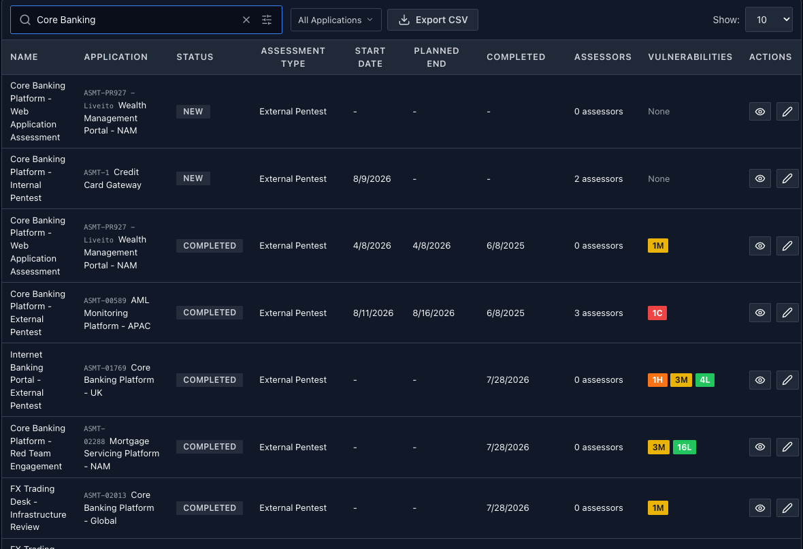
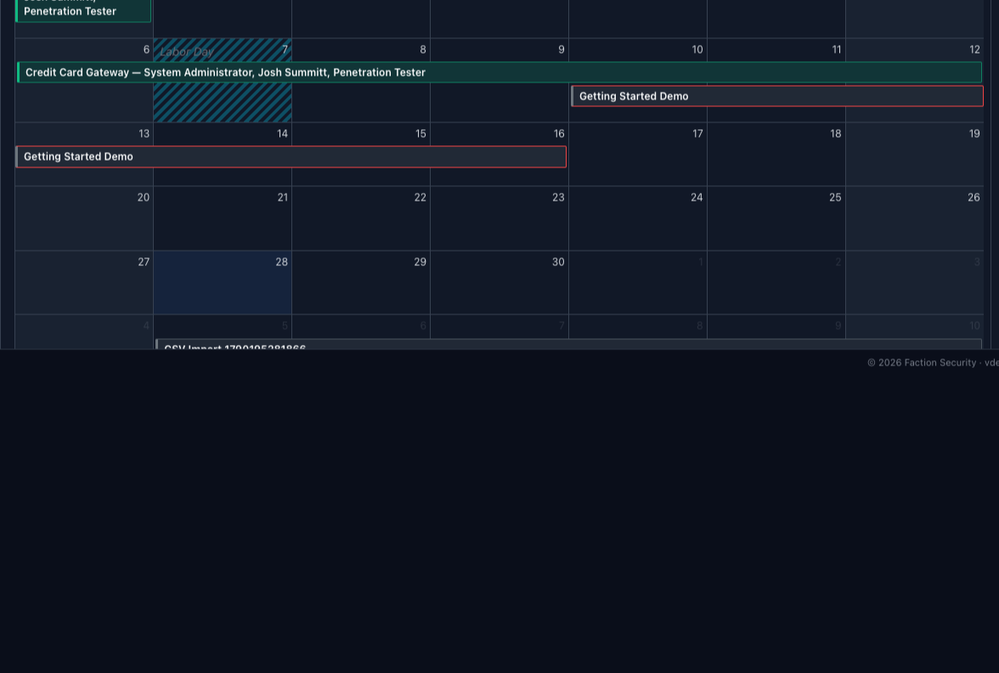
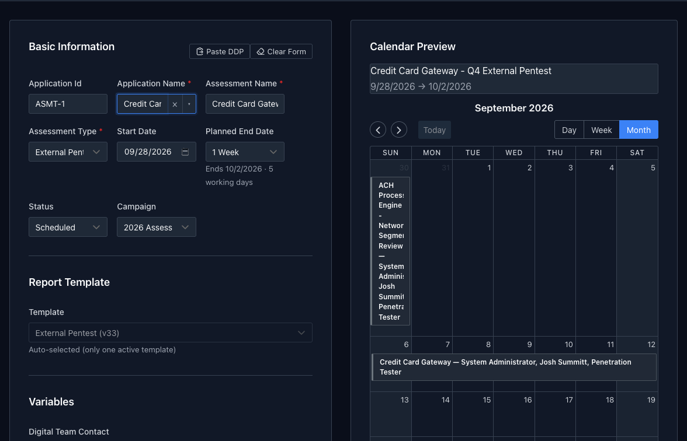
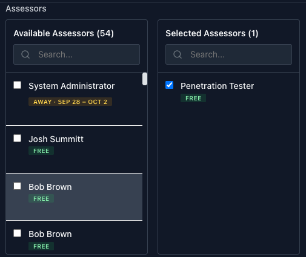
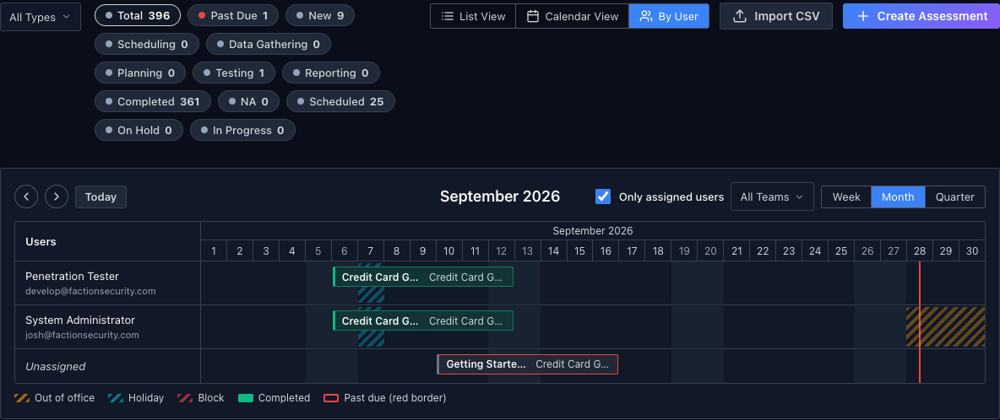
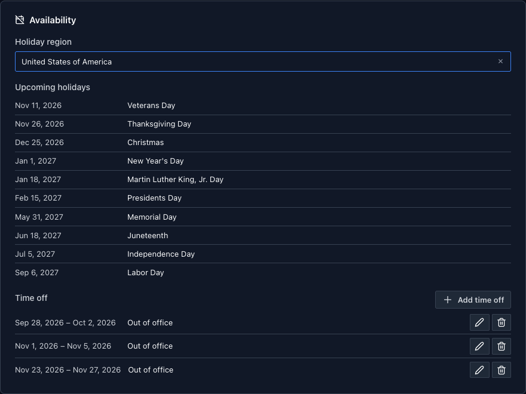
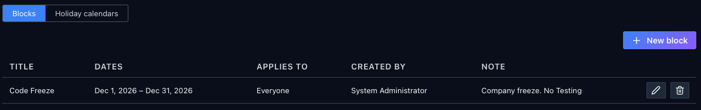
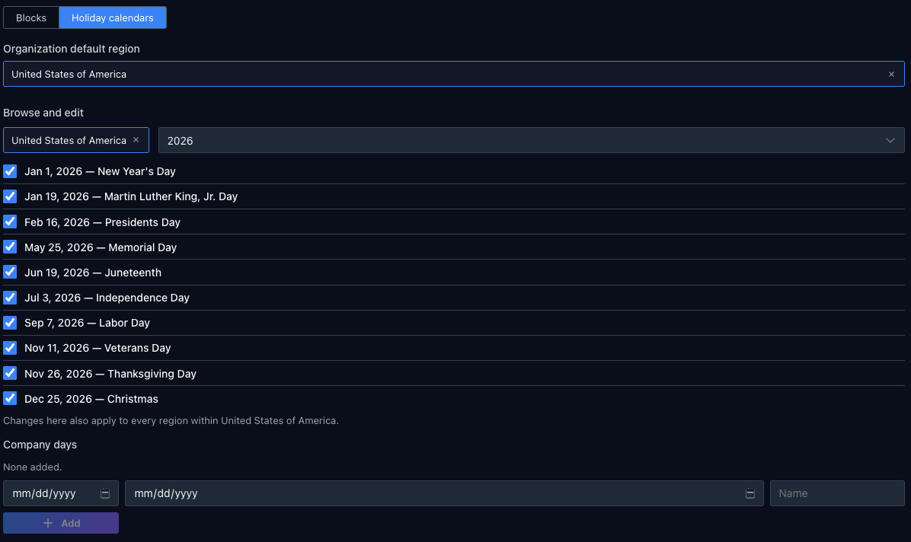

# Schedule an assessment

Every engagement in Faction starts as an assessment. An assessment ties an application, an assessment type, a date range, an assessor team and a report template together, and everything else, findings, checklists, peer review and the generated report, hangs off it.

## 1. Open Scheduling

Click **Scheduling** in the sidebar. This is the planning view for every assessment. The chips across the top count assessments by status; click one or more to filter by those statuses. **All Types** narrows the page to one assessment type. Three views sit to the right:

- **List View** is a table of every assessment with its application, status, type, dates, assessors and finding counts. Search matches the assessment or application, and **Export CSV** downloads what the filters show.
- **Calendar View** lays the engagements out by **Month**, **Week** or **Day**. Public holidays and scheduling blocks are shaded, and a past-due engagement has a red border. Drag an engagement to move its dates.
- **By User** puts one row per person, so you can see who is booked and who is free. See [The By User timeline](#the-by-user-timeline).

Click **Create Assessment** in the top right. To schedule many at once, **Import CSV** takes a spreadsheet instead; see [Bulk-import assessments from a CSV](import-assessments-csv.md).

## 2. Fill in the basics

| Field | What to enter |
|---|---|
| **Application Name** | Start typing to search the applications already in Faction, or type a new name to create one on the spot. The application is what the assessment is testing |
| **Assessment Name** | Faction pre-fills it from the application name. Change it to something you will recognize in a list, such as `Getting Started Demo` |
| **Assessment Type** | The kind of engagement, for example **Web Application Pentest**. The type decides which report templates, checklists and workflow apply |
| **Start Date** and **Planned End Date** | Pick a start date; the end date follows from the duration you choose, and Faction shows how many working days that is. The **Calendar Preview** on the right shows the engagement against everything else scheduled |
| **Status** | Leave it at the first status of the workflow, such as **New** |

## 3. Confirm the report template

Once the assessment type is chosen, the **Report Template** section fills itself in. When there is exactly one template for the type, Faction selects it for you and says so.

!!! info "This is the default template"
    On a fresh install the template for Web Application Pentest, **Web Assessment Report**, is the [default Faction pentest template](https://github.com/factionsecurity/report_templates) that a new install downloads on first start. It gives you a complete, professional report out of the box, and it is the template this walkthrough uses. Nothing about it is fixed: [Using DOCX Report Templates](../reporting/docx-templates.md) explains how to design your own, and [User Defined Fields](../reporting/user-defined-fields.md) how to add your own inputs to it.

## 4. Confirm your assessment contacts and scope

Further down the form you can add contacts, assessors, stakeholders and scope. None of them are required for a first run, but the assessors are worth setting now so the engagement shows up on the right people's calendars.

The **Assessors** list checks the dates you picked against each person's schedule and marks them:

| Badge | Meaning |
|---|---|
| **Free** | Nothing else booked in those dates |
| **Busy** | Already on another assessment that overlaps. **Busy (2)** means more than one clash. Hover for the details |
| **Away** | Out of office, or covered by a scheduling block, for some of those days. The dates follow, for example **Away · Sep 28 – Oct 2** |
| **Holiday** | A public holiday in their region falls in those dates |

**Away** and **Holiday** come from [team availability](#team-availability).

The last part of the form is **Scope**. This is the briefing for the assessors: test credentials, what is in and out of scope, and anything else the team needs to know before they start. It is a rich text editor, so tables, lists and emphasis all work. Below it, **Engagement URLs** lists the environments under test.

If you would rather not put credentials in the editor, or you have supporting material such as a network diagram, a spreadsheet of network ranges or an encrypted archive, attach it under **Files**. Anything added here is shared with the assessors on the assessment.

## 5. Save

Click **Save & Close**. The assessment appears on the Scheduling page, and under **Your Assessments** in the sidebar for its assessors, which is where the day-to-day work happens.

If an assessor is out of office, on holiday or under a block for any of the dates, Faction lists who and when in an **Assessors Unavailable** dialog before saving. **Save Anyway** keeps the dates; the warning never stops you. The same check runs when you drag an engagement to new dates on the calendar, and when you schedule retests.

Next: [Add findings and generate the report](first-report.md).

## The By User timeline

!!! note "Enterprise feature"
    The By User timeline is part of the commercial edition of Faction. In OWASP Faction, the open source edition, **By User** carries a paid-feature badge and describes the feature instead of showing the timeline.

**By User** turns the calendar on its side: one row per person, with their assessments laid across the days. It answers "who is free next week?" at a glance.

- **Bars** are assessments, showing the assessment and application names and colored by status. A completed one is green; a past-due one has a red border. Overlapping assessments on one person stack.
- **Shading** behind a row marks days that person can't work: **Out of office**, **Holiday** or a **Block**. The legend under the timeline shows which is which, and hovering a bar or a shaded day shows its details.
- **Unassigned** at the bottom collects assessments that have no assessor yet.
- A red line marks today.

Use the arrows and **Today** to move through time, and **Week**, **Month** or **Quarter** to set the span. **Only assigned users** hides people with nothing booked in that span, and **All Teams** narrows the rows to one team. Click a bar to open the assessment.

## Team availability

!!! note "Enterprise feature"
    Team availability is part of the commercial edition of Faction, together with the By User timeline. In OWASP Faction the assessor list shows only **Free** and **Busy**.

Faction knows when people can't work from three sources. They show up as shading on the calendar and the By User timeline, as **Away** and **Holiday** badges in the assessor list, and in the **Assessors Unavailable** warning.

### Time off

Each person records their own time off. Open the user menu in the top right, choose **My Profile**, and use the **Availability** card:

- **Holiday region** decides which public holidays count as days off. It starts at the organization's default.
- **Upcoming holidays** lists the next year's holidays for that region.
- **Time off** holds out-of-office dates. Click **Add time off**, pick the dates and, if you like, a reason. Without one, the entry shows as **Out of office**.

A manager can also record time off on someone's behalf from **Users**.

### Scheduling blocks and holiday calendars

Admins manage the rest under **Admin → People & Access → Availability**.

**Blocks** are periods nobody should be scheduled, such as a code freeze or a company shutdown. Click **New block**, give it a **Title** and dates, and choose who it **Applies to**: **Everyone**, **A team** or **Specific users**.

**Holiday calendars** sets the **Organization default region** and lets you tailor the built-in public holidays. Under **Browse and edit**, pick a region and year and untick any holiday your company works. **Company days** adds your own days off for a region, such as an extra day at the end of the year.

Managing blocks takes the `availability:manage:team` or `availability:manage:all` permission, and the holiday calendars take `availability:configure`. See [Availability](../permissions/reference.md#availability) in the permission reference.
