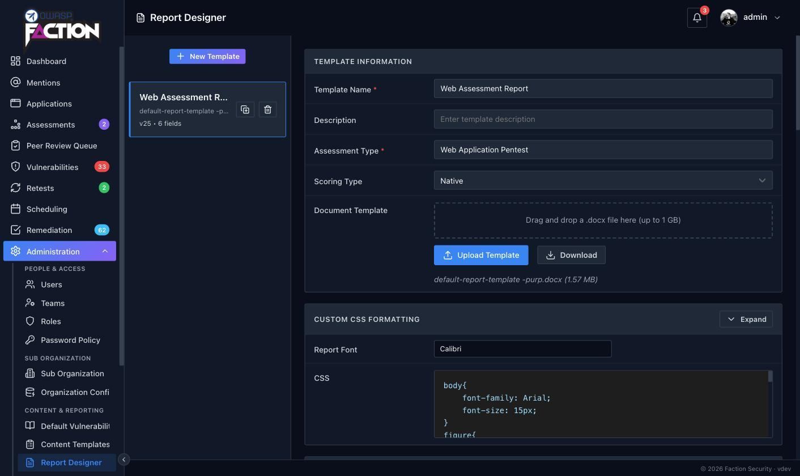

# Using DOCX Report Templates


The Faction Report Designer allows you to create custom security report templates for each assessment type. When building reports, you need to use the variables listed below. Entering these into your DOCX reports will auto-replace the assessment and vulnerability text when the report is generated. You can even use the same variables in many of Faction's input fields outside of the report template (like Risk Assessment Summaries), and it will auto-populate the fields when the report is generated.

You can download the sample templates here: [Sample Templates](https://github.com/factionsecurity/report_templates)

Templates are managed under **Admin → Content & Reporting → Report Designer**. Each template is tied to an assessment type and carries its own document (`.docx`), scoring type (native, CVSS 3.1 or CVSS 4.0), report font, CSS, report sections and user-defined fields.

!!! note
    You should disable spellcheck in your template document while adding variables. The spellcheck can cause the variables to contain attributes that will make the variable unrecognizable to the Faction document parser.

!!! note
    If you get an error about a malformed file after the report is generated, try opening the template in [LibreOffice](https://www.libreoffice.org/) and saving it before uploading the template to Faction.

## What's new in Faction 2

Templates written for Faction 1 work unchanged. Faction 2 adds the following:

- **`${assetLocation}`** — the finding's asset location (URL, host or path). Available in finding tables and finding blocks.
- **`${if-section}` / `${end-section}`** — wrap any part of the template so it disappears entirely when a section has no findings. See [Conditional sections](#conditional-sections).
- **`${pageBreak}`** — insert a real page break, including one per finding inside a repeated block.
- **`${sevId}`** — a per-severity finding counter such as `CV1`, `CV2`, `HV1`.
- **`${tracking}` is always filled in.** Every finding is given a unique tracking ID (`VID-10000`, `VID-10001`, …) when it is created. A finding carried forward into a retest keeps its number, and the ID can still be edited on the finding.
- **`${closedInDevAt}` / `${closedInStagingAt}`** — remediation milestone dates alongside `${openedAt}` and `${closedAt}`.
- **Custom variables are no longer prefixed with `cf`.** In Faction 2 you choose the variable name yourself when you create a user-defined field in the Report Designer, so `${cfAffectedURL}` in Faction 1 becomes whatever you named the field, for example `${affected-url}`. See [User Defined Fields](user-defined-fields.md).

## General variables

All of these variables can be used anywhere in the DOCX template. Those with a star ⭐️ can also be used inside Faction's rich-text fields (summaries, custom variables) to build reusable content.

- **${TOC}** – Placeholder for the Table of Contents
- **${summary1}** – The high level summary
- **${summary2}** – The objective and scope
- **${asmtId}** – Internal database ID ⭐️
- **${asmtAppId}** – The assigned Application ID ⭐️
- **${asmtName}** – The Assessment Name ⭐️
- **${asmtAssessor}** – The first assessor assigned to the assessment ⭐️
- **${asmtAssessor_Email}** – The first assessor's email address ⭐️
- **${asmtAssessor_Email link}** – Must be used in a hyperlink. Prepends `mailto:` so the hyperlink works correctly
- **${asmtAssessors_Lines}** – All assessors, one per line ⭐️
- **${asmtAssessors_Comma}** – All assessors as a comma-delimited list ⭐️
- **${asmtAssessors_Bullets}** – All assessors as a bulleted list ⭐️
- **${remediation}** – The remediation contact assigned to the assessment ⭐️
- **${riskCount*}** – The number of findings at a given severity: `${riskCount9}` Critical, `${riskCount8}` High, `${riskCount7}` Medium, `${riskCount6}` Low, `${riskCount5}` Informational ⭐️
- **${riskTotal}** – The total number of findings at all severities ⭐️
- **${asmtType}** – The type of the assessment ⭐️
- **${asmtStart}** – The start date of the assessment ⭐️
- **${asmtStart MM/dd/yyyy}** – The start date with date formatting. Uses [Java SimpleDateFormat](https://docs.oracle.com/javase/8/docs/api/java/text/SimpleDateFormat.html) patterns ⭐️
- **${asmtEnd}** – The end date of the assessment ⭐️
- **${asmtEnd MM/dd/yyyy}** – The end date with date formatting ⭐️
- **${today}** – The day the report is generated ⭐️
- **${today MM/dd/yyyy}** – The day the report is generated with date formatting ⭐️
- **${your_variable_name}** – Assessment-level user-defined fields you create in the Report Designer, referenced by the variable name you gave them ⭐️
- **${totalOpenVulns}** – Use in retest reports to show the count of open vulnerabilities
- **${totalClosedVulns}** – Use in retest reports to show the count of closed vulnerabilities
- **${pageBreak}** – Replaced with a page break. Put it in a paragraph of its own
- **{[asmtCRITICAL]}**, **{[asmtHIGH]}**, **{[asmtMEDIUM]}**, **{[asmtLOW]}**, **{[asmtINFORMATIONAL]}** – A numbered list of the finding names at that severity. Note the different bracket style; these are meant for rich-text fields such as the summaries


### Date formatting

Any of the date variables accepts a format pattern after the name, separated by a space. The default is `MM/dd/yyyy`.

```
${today}                     05/09/2026
${today MMMM d, yyyy}        September 5, 2026
${asmtStart yyyy-MM-dd}      2026-09-05
${asmtEnd EEEE, d MMM yyyy}  Saturday, 5 Sep 2026
```

## Vulnerability table variables

This is one of two methods to configure your technical findings or vulnerability summaries. This method requires you to create a specially crafted table in your DOCX report template. [See an example on GitHub.](https://github.com/factionsecurity/report_templates/blob/main/default-report-template.docx)

These are only available inside tables.

- **${vulnTable}** – Marks a table as a vulnerability listing table
- **${vulnTable Section_Name}** – Marks a table as a vulnerability listing table for one report section. See [Report sections](#report-sections)
- **${vulnName}** – The vulnerability name
- **${rec}** – Vulnerability recommendation
- **${desc}** – Vulnerability description
- **${details}** – Inserts the screenshots and exploit steps for each vulnerability
- **${category}** – Category of the vulnerability
- **${severity}** – Severity of each vulnerability, using the labels configured for your installation
- **${likelihood}** – Likelihood of the vulnerability
- **${impact}** – Impact of the vulnerability
- **${cvssScore}** – CVSS score of the vulnerability
- **${cvssString}** – CVSS vector of the vulnerability
- **${cvssString link}** – Can only be used in a hyperlink. Automatically links to the first.org CVSS calculator
- **${assetLocation}** – The asset location recorded on the finding (URL, host, path)
- **${count}** – Row count of the vulnerability
- **${sevId}** – Severity-scoped counter: the first letter of the severity, `V`, and the finding's position within that severity, e.g. `CV1`, `CV2`, `HV1`
- **${tracking}** – Tracking ID of the vulnerability. Faction assigns one automatically (`VID-10000`, `VID-10001`, …) when the finding is created and keeps it when the finding is carried forward into a later assessment. It can be edited on the finding
- **${vid}** – Vulnerability internal database ID
- **${openedAt}** – The date the vulnerability began tracking
- **${closedAt}** – The date the vulnerability was closed (no longer tracked)
- **${closedInDevAt}** – The date the vulnerability was marked fixed in development
- **${closedInStagingAt}** – The date the vulnerability was marked fixed in staging
- **${remediationStatus}** – Displays only "Open" or "Closed"
- **${your_variable_name}** – Vulnerability-level user-defined fields, referenced by the variable name you gave them in the Report Designer
- **${color key=value,key=value}** – The colour of the text is based on key-value pairs. [See below for how to set up colours.](#setting-severity-colours)
- **${cells key=value,key=value}** – The colour of the table cell is based on key-value pairs. [See below for how to set up colours.](#setting-severity-colours)
- **${custom-fields key=value,key=value,...}** – Maps a custom variable to the placeholder colour used in the DOCX template. This allows you to set font and cell colours for custom variables. [See below.](#setting-custom-variable-colours)
- **${loop}** – Tells the report generator which row will be repeated
- **${loop-*}** – Allows multiple rows to be repeated. `${loop-1}` repeats the row it is in plus the one below it
- **${noIssuesText Your text}** – The text displayed in the section if no vulnerabilities are reported. Defaults to "No issues detected for this section."

### Example summary table

The `${loop}` variable will allow the report generation to iterate each vulnerability into one row.

|   |   |   |   |
|---|---|---|---|
|${vulnTable}|${color Critical=C00000,High=FFC000}|||
|ID|Finding Name|Impact|Severity|
|${loop}|${count}. ${vulnName}|${impact}|${severity}|

Example in DOCX template:


Example rendered:


### Example detail table

The `${loop-4}` variable will allow the report generation to iterate each vulnerability over 4 rows below the loop for a total of 5 rows that will be repeated.


**Why is the heading yellow?** Check [Setting severity colours](#setting-severity-colours).

Example rendered:


## Vulnerability block variables

**For when you do not want to use tables to display your vulnerability information.** You can use the following variables for inserting vulnerability information outside of a table. This method takes a block of text with all formatting between `${fiBegin}` and `${fiEnd}` to use as a vulnerability template. This can contain any DOCX elements, including tables.

- **${fiBegin} / ${fiEnd}** – Block to repeat for every finding
- **${fiBegin Section_Name} / ${fiEnd Section_Name}** – Block to repeat for the findings in one report section. See [Report sections](#report-sections)
- **${vulnName}** – The vulnerability name
- **${rec}** – Vulnerability recommendation
- **${desc}** – Vulnerability description
- **${details}** – Inserts the screenshots and exploit steps for each vulnerability
- **${category}** – Category of the vulnerability
- **${severity}** – Severity of each vulnerability
- **${likelihood}** – Likelihood of the vulnerability
- **${impact}** – Impact of the vulnerability
- **${cvssScore}** – CVSS score of the vulnerability
- **${cvssString}** – CVSS vector of the vulnerability
- **${cvssString link}** – Can only be used in a hyperlink. Automatically links to the first.org CVSS calculator
- **${assetLocation}** – The asset location recorded on the finding
- **${count}** – Running count of the vulnerability
- **${sevId}** – Severity-scoped counter, e.g. `CV1`, `HV2`
- **${tracking}** – Tracking ID of the vulnerability, assigned automatically (`VID-10000`, …) and kept across carry-forwards
- **${vid}** – Vulnerability internal database ID
- **${openedAt}** – The date the vulnerability began tracking
- **${closedAt}** – The date the vulnerability was closed
- **${closedInDevAt}** – The date the vulnerability was marked fixed in development
- **${closedInStagingAt}** – The date the vulnerability was marked fixed in staging
- **${remediationStatus}** – Displays only "Open" or "Closed"
- **${your_variable_name}** – Vulnerability-level user-defined fields
- **${pageBreak}** – A page break. Inside a block it is repeated with the block, so each finding starts on a new page
- **${color key=value,key=value}** – The colour of the text is based on key-value pairs. [See below for how to set up colours.](#setting-severity-colours)
- **${fill key=value,key=value}** – The colour of background elements is based on key-value pairs. [See below for how to set up colours.](#setting-severity-colours)
- **${custom-fields key=value,key=value,...}** – Maps a custom variable to the placeholder colour used in the DOCX template. [See below.](#setting-custom-variable-colours)
- **${noIssuesText Your text}** – The text displayed in the section if no vulnerabilities are reported

The `${color}`, `${fill}` and `${custom-fields}` configuration paragraphs are removed from the generated report.

### Example block findings

```
${fiBegin}

${fill Critical=8064a2,High=c0504d,Medium=e68e00,Low=33D7FF,Recommended=081417,Informational=657376}

## 1.     ${vulnName} - ${severity}

Description:

${desc}

Recommendation:

${rec}

${details}

${pageBreak}

${fiEnd}
```


**Why is the heading yellow?** Check [Setting severity colours](#setting-severity-colours).


## Hyperlinks

If you want to add hyperlinks to variables, this can be done with some variables by appending `link` after the variable. Only a few built-in variables support this (`${asmtAssessor_Email link}`, `${cvssString link}`) but every custom variable does. This allows you to add things like `${affected-url link}` to your vulnerability templates, which will generate a hyperlink to whatever URL was entered.

Below is an example of how you would add this. Note that the "Address" in the DOCX template can be anything. It will be deleted and replaced with the user-defined variable for Affected URL.


## Report sections

!!! note "Enterprise feature"
    Report sections are available in paid editions of Faction. In editions without them every finding renders under the default section, whatever section it was filed in.

You can put findings into different sections of your report. You may want to use sections if you are doing different types of pen tests in one report and need to keep these sections separated. For example, you can segregate findings into Web Assessments  and Mobile Assessments sections.

To use sections you need to create the section names in the Report Designer, under **Report Sections**:


A section is referenced in the template by its name with spaces replaced by underscores. The Report Designer shows the exact token to use next to each section, so **Web Assessment** is written `Web_Assessment`.

Once the sections are created, you can add them to the report in two ways:

1. Vulnerability block variables: `${fiBegin Your_Section_Name}` / `${fiEnd Your_Section_Name}`
2. Vulnerability table variables: `${vulnTable Your_Section_Name}`

The bare tags (`${fiBegin}`, `${vulnTable}`) are the default section. It receives every finding that has no section, and every finding filed under a section the template no longer defines, so nothing is silently dropped.

Below is an example of how the template variables work:


### Conditional sections

When a section has no findings, its heading and introduction would normally be left behind with only the "no issues" text under them. Wrap the whole region in `${if-section}` and `${end-section}` and Faction removes everything between the two markers, heading included, when that section is empty.

```
${if-section Network_Security}

# Network Security Findings

The following issues were identified on the in-scope network ranges.

${vulnTable Network_Security}   (or a ${fiBegin Network_Security} … ${fiEnd Network_Security} block)

${end-section Network_Security}
```

- Each marker goes in a paragraph of its own. Both markers are always removed from the generated report.
- `${if-section}` / `${end-section}` with no name wraps the default section.
- A template may wrap more than one region for the same section, for example a row in the summary table and the detail block later in the document.

## CSS formatting

All of the text generated from Faction is HTML. You can control how it is rendered in the DOCX format using the **CSS** editor in the Report Designer. You will need to set the CSS to match your report template. Things like font and size will need to match. Images will need to be forced to resize to the correct dimensions to fit in your reports.

The Report Designer also has a **Report Font** setting that is applied to all generated text, so you only need CSS for anything beyond the base font.


Every rich-text variable is wrapped in a `div` whose class is the variable name (`summary1`, `summary2`, your custom variable names, and the leading name of any extension placeholder such as `checklist-owasp-top-10`), so you can style each one separately.

## Setting severity colours

When building reports, you most likely will set the text or cell to the colour that matches the severity of the finding. To achieve this in Faction, you need to set a placeholder colour in the DOCX template that matches the severity category (Overall, Likelihood, and Impact). These placeholder colours are in the table below:

|   |   |
|---|---|
|**Category**|**Colour Hex**|
|Overall Severity|#FAC701|
|Likelihood|#FAC702|
|Impact|#FAC703|

For example, a table in MS Word below has pre-filled the colour codes for each severity name and category.


Right-click the overall severity variable, **${severity}**; you can see the placeholder hex code for this colour is #FAC701. Likelihood would be set to #FAC702, and Impact would be set to #FAC703.


Setting the background colour for cells works in much the same way. Notice we use the `${cells}` variable instead.


Right-click on the cell and set the colour. You may only want to use the Overall severity option but you can have multiple cells with each category if you wish.


Below is an example of the generated report table with colours replaced.


!!! tip
    The keys in `${color}`, `${cells}` and `${fill}` are matched against the severity **labels** shown in the report. If you have renamed the severities in Faction's terminology settings, use your labels as the keys.

## Setting custom variable colours

Faction allows you to set up a colour scheme to call out data in custom variables. You can use this to highlight things that require more attention or anything else you can imagine.

To demonstrate this, we are going to create two custom variables in the Report Designer, `${MyVariable}` and `${MyOtherVariable}`.

Set the background colour of `${MyVariable}` to `AEAAAA` and the background colour of `${MyOtherVariable}` to `DBDBDB` in our DOCX template. These values can be anything, as long as they're an RGB hex code. We chose these just so they stand out in this example. Once configured it should look like this:


Now add the `${custom-fields}` variable at the top of our vulnerability findings block. This variable maps a custom field to the placeholder colour we want to change when the report is generated.

```
${custom-fields MyVariable=AEAAAA,MyOtherVariable=DBDBDB}
```

We can now set the colour based on the text that gets entered into these fields. Let's say if the text displays "Happy" then the background will be green and if it says "Sad" then the background will be red.

We can add these colours to the `${fill}` variable. It will look something like this:

```
${fill Critical=8064a2,High=c0504d,Medium=e68e00,Low=33D7FF,Recommended=081417,Informational=657376,Happy=C5E0B3,Sad=EE5654}
```

The full config in the DOCX will look like this:


When we add a vulnerability, we can select our Happy or Sad option for these two custom variables:


When we generate the report, these backgrounds get updated accordingly.


## Uploading your template

When your DOCX is ready, upload it in the Report Designer under **Admin → Content & Reporting → Report Designer**.



1. Select the template on the left, or click **New Template** to start one. A template is tied to one **Assessment Type**, so create one per type of engagement you report on.
2. In **Document Template**, drag the `.docx` onto the drop zone or click **Upload Template** and choose the file. The current file's name and size are shown underneath, and **Download** returns the copy Faction holds, which is handy when the original has gone missing.
3. Set the **Report Font** and any **CSS** you need under Custom CSS Formatting, add report sections and user defined fields further down, and the template is ready to use.

There is no separate save step: the Report Designer saves each change as you make it. Assessments created from now on pick the template up automatically; an assessment that already exists keeps generating with the version it was created against until its template is updated.

!!! tip "Start from the default"
    A fresh install already has the [default Faction pentest template](https://github.com/factionsecurity/report_templates) attached to the Web Application Pentest type. Click **Download** on it to get the DOCX, edit that in Word, and upload the result. Every variable it uses is documented above, so it is the quickest route to a branded template that still works.
