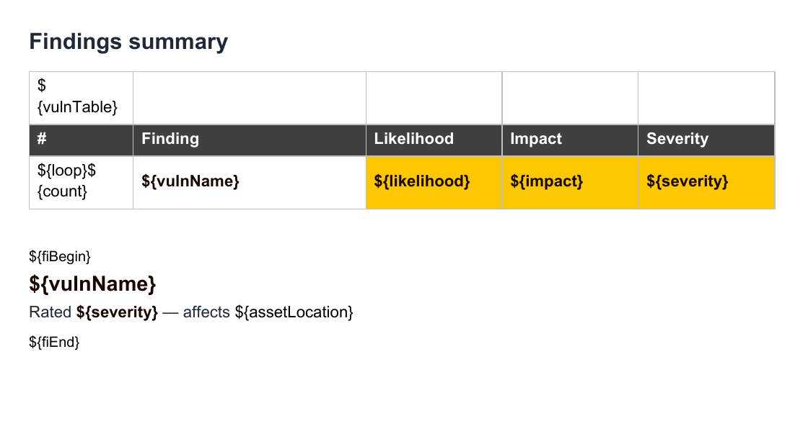
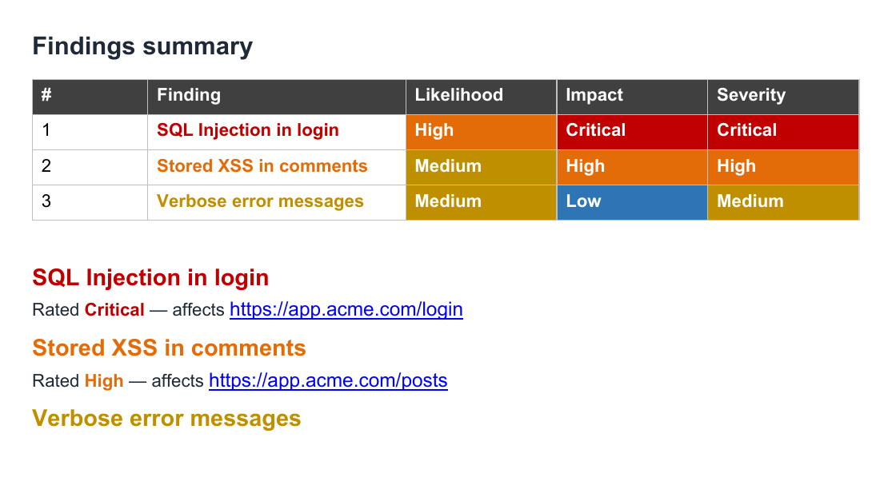

# Using DOCX Report Templates


The Faction Report Designer allows you to create custom security report templates for each assessment type. When building reports, you need to use the variables listed below. Entering these into your DOCX reports will auto-replace the assessment and vulnerability text when the report is generated. You can even use the same variables in many of Faction's input fields outside of the report template (like Risk Assessment Summaries), and it will auto-populate the fields when the report is generated.

You can download the sample templates here: [Sample Templates](https://github.com/factionsecurity/report_templates)

Templates are managed under **Admin → Content & Reporting → Report Designer**. Each template is tied to an assessment type and carries its own document (`.docx`), scoring type (native, CVSS 3.1 or CVSS 4.0), report font, CSS, report sections and user-defined fields.

!!! note
    You should disable spellcheck in your template document while adding variables. The spellcheck can cause the variables to contain attributes that will make the variable unrecognizable to the Faction document parser.

!!! note
    If you get an error about a malformed file after the report is generated, try opening the template in [LibreOffice](https://www.libreoffice.org/) and saving it before uploading the template to Faction.

## What's new in Faction 2

Templates written for Faction 1 work unchanged, with one exception: **colors**. The `${color}`, `${cells}`, `${fill}` and `${custom-fields}` markers are no longer read — colors are now set in the Report Designer. The placeholder colors you painted in the template still work. See [Upgrading a Faction 1 template](#upgrading-a-faction-1-template).

Faction 2 adds the following:

- **`${assetLocation}`** — the finding's asset location (URL, host or path). Available in finding tables and finding blocks. When it is a web address it becomes a clickable link.
- **Hyperlink fields** — a user-defined field type whose value becomes a clickable link wherever its variable sits. Email addresses become `mailto:` links. See [Hyperlinks](#hyperlinks).
- **Finding colors in the Report Designer** — pick the color for each severity, likelihood and impact without opening Word, and each placeholder color now has a dark twin so your template stays readable while you build it. See [Setting severity colors](#setting-severity-colors).
- **`${if-section}` / `${end-section}`** — wrap any part of the template so it disappears entirely when a section has no findings. See [Conditional sections](#conditional-sections).
- **`${pageBreak}`** — insert a real page break, including one per finding inside a repeated block.
- **`${sevId}`** — a per-severity finding counter such as `CV1`, `CV2`, `HV1`.
- **`${tracking}` is always filled in.** Every finding is given a unique tracking ID (`VID-10000`, `VID-10001`, …) when it is created. A finding carried forward into a retest keeps its number, and the ID can still be edited on the finding.
- **`${closedInDevAt}` / `${closedInStagingAt}`** — remediation milestone dates alongside `${openedAt}` and `${closedAt}`.
- **Custom variables are no longer prefixed with `cf`.** In Faction 2 you choose the variable name yourself when you create a user-defined field in the Report Designer, so `${cfAffectedURL}` in Faction 1 becomes whatever you named the field, for example `${affected-url}`. See [User Defined Fields](user-defined-fields.md).

## General variables

All of these variables can be used anywhere in the DOCX template. Those with a star ⭐️ can also be used inside Faction's rich-text fields (summaries, custom variables) to build reusable content.

- **${TOC}** – Placeholder for the Table of Contents
- **${summary1}** – The high level summary
- **${summary2}** – The objective and scope
- **${asmtId}** – Internal database ID ⭐️
- **${asmtAppId}** – The assigned Application ID ⭐️
- **${asmtName}** – The Assessment Name ⭐️
- **${asmtAssessor}** – The first assessor assigned to the assessment ⭐️
- **${asmtAssessor_Email}** – The first assessor's email address ⭐️
- **${asmtAssessor_Email link}** – Must be used in a hyperlink. Prepends `mailto:` so the hyperlink works correctly
- **${asmtAssessors_Lines}** – All assessors, one per line ⭐️
- **${asmtAssessors_Comma}** – All assessors as a comma-delimited list ⭐️
- **${asmtAssessors_Bullets}** – All assessors as a bulleted list ⭐️
- **${remediation}** – The remediation contact assigned to the assessment ⭐️
- **${riskCount*}** – The number of findings at a given severity: `${riskCount9}` Critical, `${riskCount8}` High, `${riskCount7}` Medium, `${riskCount6}` Low, `${riskCount5}` Informational ⭐️
- **${riskTotal}** – The total number of findings at all severities ⭐️
- **${asmtType}** – The type of the assessment ⭐️
- **${asmtStart}** – The start date of the assessment ⭐️
- **${asmtStart MM/dd/yyyy}** – The start date with date formatting. Uses [Java SimpleDateFormat](https://docs.oracle.com/javase/8/docs/api/java/text/SimpleDateFormat.html) patterns ⭐️
- **${asmtEnd}** – The end date of the assessment ⭐️
- **${asmtEnd MM/dd/yyyy}** – The end date with date formatting ⭐️
- **${today}** – The day the report is generated ⭐️
- **${today MM/dd/yyyy}** – The day the report is generated with date formatting ⭐️
- **${your_variable_name}** – Assessment-level user-defined fields you create in the Report Designer, referenced by the variable name you gave them ⭐️
- **${totalOpenVulns}** – Use in retest reports to show the count of open vulnerabilities
- **${totalClosedVulns}** – Use in retest reports to show the count of closed vulnerabilities
- **${pageBreak}** – Replaced with a page break. Put it in a paragraph of its own
- **{[asmtCRITICAL]}**, **{[asmtHIGH]}**, **{[asmtMEDIUM]}**, **{[asmtLOW]}**, **{[asmtINFORMATIONAL]}** – A numbered list of the finding names at that severity. Note the different bracket style; these are meant for rich-text fields such as the summaries


### Date formatting

Any of the date variables accepts a format pattern after the name, separated by a space. The default is `MM/dd/yyyy`.

```
${today}                     05/09/2026
${today MMMM d, yyyy}        September 5, 2026
${asmtStart yyyy-MM-dd}      2026-09-05
${asmtEnd EEEE, d MMM yyyy}  Saturday, 5 Sep 2026
```

## Vulnerability table variables

This is one of two methods to configure your technical findings or vulnerability summaries. This method requires you to create a specially crafted table in your DOCX report template. [See an example on GitHub.](https://github.com/factionsecurity/report_templates/blob/main/default-report-template.docx)

These are only available inside tables.

- **${vulnTable}** – Marks a table as a vulnerability listing table
- **${vulnTable Section_Name}** – Marks a table as a vulnerability listing table for one report section. See [Report sections](#report-sections)
- **${vulnName}** – The vulnerability name
- **${rec}** – Vulnerability recommendation
- **${desc}** – Vulnerability description
- **${details}** – Inserts the screenshots and exploit steps for each vulnerability
- **${category}** – Category of the vulnerability
- **${severity}** – Severity of each vulnerability, using the labels configured for your installation
- **${likelihood}** – Likelihood of the vulnerability
- **${impact}** – Impact of the vulnerability
- **${cvssScore}** – CVSS score of the vulnerability
- **${cvssString}** – CVSS vector of the vulnerability
- **${cvssString link}** – Can only be used in a hyperlink. Automatically links to the first.org CVSS calculator
- **${assetLocation}** – The asset location recorded on the finding (URL, host, path). A web address becomes a clickable link; a host and port, a path or a name is shown as plain text
- **${count}** – Row count of the vulnerability
- **${sevId}** – Severity-scoped counter: the first letter of the severity, `V`, and the finding's position within that severity, e.g. `CV1`, `CV2`, `HV1`
- **${tracking}** – Tracking ID of the vulnerability. Faction assigns one automatically (`VID-10000`, `VID-10001`, …) when the finding is created and keeps it when the finding is carried forward into a later assessment. It can be edited on the finding
- **${vid}** – Vulnerability internal database ID
- **${openedAt}** – The date the vulnerability began tracking
- **${closedAt}** – The date the vulnerability was closed (no longer tracked)
- **${closedInDevAt}** – The date the vulnerability was marked fixed in development
- **${closedInStagingAt}** – The date the vulnerability was marked fixed in staging
- **${remediationStatus}** – Displays only "Open" or "Closed"
- **${your_variable_name}** – Vulnerability-level user-defined fields, referenced by the variable name you gave them in the Report Designer
- **Colors** – Paint a placeholder color on a cell, text or border and Faction replaces it with the color for that finding. [See Setting severity colors.](#setting-severity-colors)
- **${loop}** – Tells the report generator which row will be repeated
- **${loop-*}** – Allows multiple rows to be repeated. `${loop-1}` repeats the row it is in plus the one below it
- **${noIssuesText Your text}** – The text displayed in the section if no vulnerabilities are reported. Defaults to "No issues detected for this section."

### Example summary table

The `${loop}` variable will allow the report generation to iterate each vulnerability into one row.

|   |   |   |   |
|---|---|---|---|
|${vulnTable}||||
|ID|Finding Name|Impact|Severity|
|${loop}|${count}. ${vulnName}|${impact}|${severity}|

Example in DOCX template:


The `${color …}` cell in this screenshot is from an older template. It is no longer needed and is ignored if present — the colors come from the Report Designer.


Example rendered:


### Example detail table

The `${loop-4}` variable will allow the report generation to iterate each vulnerability over 4 rows below the loop for a total of 5 rows that will be repeated.


**Why is the heading yellow?** Check [Setting severity colors](#setting-severity-colors).

Example rendered:


## Vulnerability block variables

**For when you do not want to use tables to display your vulnerability information.** You can use the following variables for inserting vulnerability information outside of a table. This method takes a block of text with all formatting between `${fiBegin}` and `${fiEnd}` to use as a vulnerability template. This can contain any DOCX elements, including tables.

- **${fiBegin} / ${fiEnd}** – Block to repeat for every finding
- **${fiBegin Section_Name} / ${fiEnd Section_Name}** – Block to repeat for the findings in one report section. See [Report sections](#report-sections)
- **${vulnName}** – The vulnerability name
- **${rec}** – Vulnerability recommendation
- **${desc}** – Vulnerability description
- **${details}** – Inserts the screenshots and exploit steps for each vulnerability
- **${category}** – Category of the vulnerability
- **${severity}** – Severity of each vulnerability
- **${likelihood}** – Likelihood of the vulnerability
- **${impact}** – Impact of the vulnerability
- **${cvssScore}** – CVSS score of the vulnerability
- **${cvssString}** – CVSS vector of the vulnerability
- **${cvssString link}** – Can only be used in a hyperlink. Automatically links to the first.org CVSS calculator
- **${assetLocation}** – The asset location recorded on the finding
- **${count}** – Running count of the vulnerability
- **${sevId}** – Severity-scoped counter, e.g. `CV1`, `HV2`
- **${tracking}** – Tracking ID of the vulnerability, assigned automatically (`VID-10000`, …) and kept across carry-forwards
- **${vid}** – Vulnerability internal database ID
- **${openedAt}** – The date the vulnerability began tracking
- **${closedAt}** – The date the vulnerability was closed
- **${closedInDevAt}** – The date the vulnerability was marked fixed in development
- **${closedInStagingAt}** – The date the vulnerability was marked fixed in staging
- **${remediationStatus}** – Displays only "Open" or "Closed"
- **${your_variable_name}** – Vulnerability-level user-defined fields
- **${pageBreak}** – A page break. Inside a block it is repeated with the block, so each finding starts on a new page
- **Colors** – Paint a placeholder color on text, a shaded paragraph or a border and Faction replaces it with the color for that finding. [See Setting severity colors.](#setting-severity-colors)
- **${noIssuesText Your text}** – The text displayed in the section if no vulnerabilities are reported

A `${color}`, `${fill}` or `${custom-fields}` paragraph left over from a Faction 1 template is removed from the generated report and otherwise ignored.

### Example block findings

```
${fiBegin}

## 1.     ${vulnName} - ${severity}

Description:

${desc}

Recommendation:

${rec}

${details}

${pageBreak}

${fiEnd}
```


**Why is the heading yellow?** Check [Setting severity colors](#setting-severity-colors).


## Hyperlinks

There are three ways a variable becomes a clickable link in the report.

**Hyperlink fields.** Create the user-defined field with the **Hyperlink** type and use its variable as normal, for example `${affected-url}`. It becomes a real Word hyperlink wherever it sits — in a sentence, a table cell or a findings block — with nothing else to set up in the template. An email address links as `mailto:`, a web address links to itself, and a value holding several addresses gives one link each. [See Hyperlink fields.](user-defined-fields.md#hyperlink-fields)

**Asset locations.** `${assetLocation}` is linked automatically when the finding's asset location is a web address. A host and port, a path or a name is left as plain text.

**The `link` suffix.** Some variables can be linked by appending `link`. Only a few built-in variables support this (`${asmtAssessor_Email link}`, `${cvssString link}`) but every custom variable does, so `${affected-url link}` generates a hyperlink to whatever URL was entered. Unlike a Hyperlink field, this only works when the variable sits inside a hyperlink you have already added in Word.

Below is an example of the `link` suffix. Note that the "Address" in the DOCX template can be anything. It will be deleted and replaced with the user-defined variable for Affected URL.


## Report sections

!!! note "Enterprise feature"
    Report sections are available in paid editions of Faction. In editions without them every finding renders under the default section, whatever section it was filed in.

You can put findings into different sections of your report. You may want to use sections if you are doing different types of pen tests in one report and need to keep these sections separated. For example, you can segregate findings into Web Assessments  and Mobile Assessments sections.

To use sections you need to create the section names in the Report Designer, under **Report Sections**:


A section is referenced in the template by its name with spaces replaced by underscores. The Report Designer shows the exact token to use next to each section, so **Web Assessment** is written `Web_Assessment`.

Once the sections are created, you can add them to the report in two ways:

1. Vulnerability block variables: `${fiBegin Your_Section_Name}` / `${fiEnd Your_Section_Name}`
2. Vulnerability table variables: `${vulnTable Your_Section_Name}`

The bare tags (`${fiBegin}`, `${vulnTable}`) are the default section. It receives every finding that has no section, and every finding filed under a section the template no longer defines, so nothing is silently dropped.

Below is an example of how the template variables work:


### Conditional sections

When a section has no findings, its heading and introduction would normally be left behind with only the "no issues" text under them. Wrap the whole region in `${if-section}` and `${end-section}` and Faction removes everything between the two markers, heading included, when that section is empty.

```
${if-section Network_Security}

# Network Security Findings

The following issues were identified on the in-scope network ranges.

${vulnTable Network_Security}   (or a ${fiBegin Network_Security} … ${fiEnd Network_Security} block)

${end-section Network_Security}
```

- Each marker goes in a paragraph of its own. Both markers are always removed from the generated report.
- `${if-section}` / `${end-section}` with no name wraps the default section.
- A template may wrap more than one region for the same section, for example a row in the summary table and the detail block later in the document.

## CSS formatting

All of the text generated from Faction is HTML. You can control how it is rendered in the DOCX format using the **CSS** editor in the Report Designer. You will need to set the CSS to match your report template. Things like font and size will need to match. Images will need to be forced to resize to the correct dimensions to fit in your reports.

The Report Designer also has a **Report Font** setting that is applied to all generated text, so you only need CSS for anything beyond the base font.


Every rich-text variable is wrapped in a `div` whose class is the variable name (`summary1`, `summary2`, your custom variable names, and the leading name of any extension placeholder such as `checklist-owasp-top-10`), so you can style each one separately.

## Setting severity colors

Findings are usually color-coded by severity — a red cell for Critical, an orange one for High. In Faction you paint a **placeholder color** in the DOCX template wherever you want a color that depends on the finding, and choose the real colors in the Report Designer. When the report is generated, each placeholder is replaced with the color for that finding.

Placeholders work on table cells, text, shaded paragraphs, table borders and the numbers or bullets of a list.

### The placeholder colors

Each category has two placeholders that mean exactly the same thing: a light one and a dark one.

| Category | Light | Dark |
|---|---|---|
| Severity | `#FAC701` | `#1A0701` |
| Likelihood | `#FAC702` | `#1A0702` |
| Impact | `#FAC703` | `#1A0703` |

The pair is there so you can read your own template. Paint the **light** one on a cell and the **dark** one on the text inside it, and you see near-black text on amber while you work. It makes no difference to the report which one you use where — Faction can tell a cell from text on its own — so painting them the other way round works too.

!!! warning "Check the digits"
    The dark placeholders are `1A07…`, not `1AC7…`. An almost-right color such as `#1AC701` is an ordinary color to Faction, so it is left exactly as painted — typically a bright green that ships in the report with no warning.

To paint a cell in Word, open **Borders and Shading → Shading**, choose **More Colors** under *Fill* and type the hex code. For text, use **Font Color → More Colors**.


Here is a template using the placeholders. The Likelihood, Impact and Severity cells are painted with the light placeholders and their text with the dark ones. The finding name — in the table and in the findings block below it — is painted with the dark severity placeholder too, with no cell color behind it.



### Color and text on color

Each value has two colors, set in the Report Designer:

- **Color** — what the thing *is*: a filled cell, a border, or text that is not sitting on a colored background.
- **Text on color** — used only for text that *is* sitting on a placeholder-colored background, so it can contrast with it.

Which one a piece of painted text gets depends on what is behind it:

| Where the painted text is | Gets |
|---|---|
| In a cell filled with a placeholder | Text on color |
| On a shaded paragraph, or text with its own shading | Text on color |
| In a cell with no fill, or a cell filled with an ordinary color | Color |
| Outside a table altogether | Color |
| A table border, or a list number or bullet with no colored background | Color |

So with Critical set to white text on red, a Critical severity cell comes out white on red, while the finding's name in the column beside it and the heading in the findings block come out red on the page. Here is the template above, generated:



Because *Color* is also used for text on a white page, choose colors that are readable as text as well as behind it. A pale yellow makes a fine cell and an unreadable heading.

### Choosing the colors

Open the template in **Admin → Content & Reporting → Report Designer** and find **Finding Colors**. Every row shows the two colors side by side with a preview of how they read together, so an unreadable combination is obvious before it reaches a report. The same panel lists the placeholder colors with a copy button for each.

Likelihood and impact use the same five levels as severity, so by default one set of colors covers all three. To color them differently, tick **Use different colors for Likelihood and Impact**. Unticking it copies the Severity colors back over the other two.

Colors are matched on the severity **level**, not its name. If you have renamed the severities in Faction's terminology settings — Critical to *Sev-1*, say — the colors carry on working.

A new template starts with colors matching the ones Faction uses on screen. A placeholder for a value with no color set is replaced with black text on white, so the placeholder amber never reaches a report.

## Setting custom variable colors

A Dropdown user-defined field can be color-coded in the same way, for example a green cell when a finding's *Customer Impact* is "Low" and a red one when it is "High".

Every Dropdown field has its own group under **Finding Colors**, with a color and a text-on-color for each of its options. The first time you set a color for a field, Faction gives it its own pair of placeholders — `#FAC704` and `#1A0704` for the first field, `#FAC705` and `#1A0705` for the next, and so on — and shows them next to the field's name and in the list of placeholder colors. Paint those in the template exactly as you would the severity ones.


Here two Dropdown fields, *My Variable* and *My Other Variable*, each have a color for their Happy and Sad options. They were given `#FAC704`/`#1A0704` and `#FAC705`/`#1A0705`, which also appear at the bottom of the list of placeholder colors:


A field keeps its placeholders for good, even if you later remove its colors, so a template that still uses them can never pick up another field's colors by mistake.

When a finding is written, the assessor picks the value from the dropdown:


and the cells and text painted with that field's placeholders take the colors set for the chosen option.

String fields cannot be colored, because they have no fixed list of values to give colors to.

## Upgrading a Faction 1 template

Faction 1 templates set their colors with configuration paragraphs:

```
${color Critical=C00000,High=FFC000}
${cells Critical=8064a2,High=c0504d}
${fill Critical=8064a2,High=c0504d}
${custom-fields MyVariable=AEAAAA}
```

These are no longer read. A template that still contains them generates without errors — the paragraphs are removed from the report and ignored — but its colors come from the Report Designer instead. To bring one across:

1. Enter the colors from its `${color}`, `${cells}` or `${fill}` paragraphs under **Finding Colors**. `${color}` values usually belong in *Text on color* and `${cells}` / `${fill}` values in *Color*.
2. Delete the configuration paragraphs from the template.
3. Leave the `#FAC701`–`#FAC703` colors you already painted where they are; they still work. Repaint text with the dark placeholder if you want to read it while you edit.
4. For a custom variable that used `${custom-fields}`, set its colors in the designer, then repaint its cells with the placeholders shown next to the field. Colors you chose yourself, such as `AEAAAA`, are ordinary colors now.

## Uploading your template

When your DOCX is ready, upload it in the Report Designer under **Admin → Content & Reporting → Report Designer**.


1. Select the template on the left, or click **New Template** to start one. A template is tied to one **Assessment Type**, so create one per type of engagement you report on.
2. In **Document Template**, drag the `.docx` onto the drop zone or click **Upload Template** and choose the file. The current file's name and size are shown underneath, and **Download** returns the copy Faction holds, which is handy when the original has gone missing.
3. Set the **Report Font** and any **CSS** you need under Custom CSS Formatting, add report sections and user defined fields further down, and the template is ready to use.

There is no separate save step: the Report Designer saves each change as you make it. Assessments created from now on pick the template up automatically; an assessment that already exists keeps generating with the version it was created against until its template is updated.

!!! tip "Start from the default"
    A fresh install already has the [default Faction pentest template](https://github.com/factionsecurity/report_templates) attached to the Web Application Pentest type. Click **Download** on it to get the DOCX, edit that in Word, and upload the result. Every variable it uses is documented above, so it is the quickest route to a branded template that still works.
