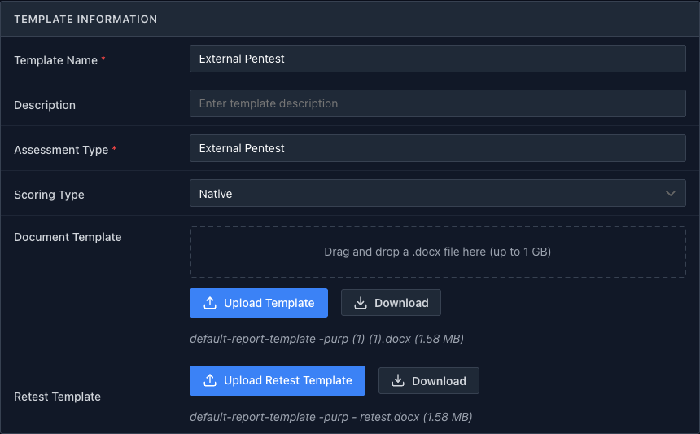
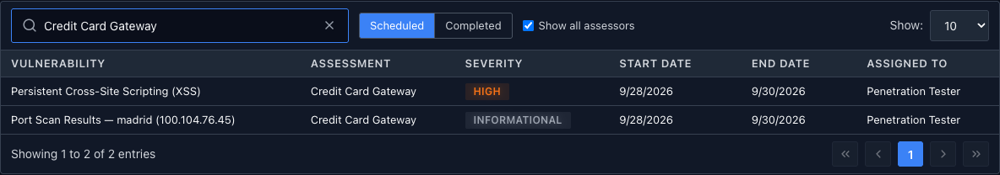
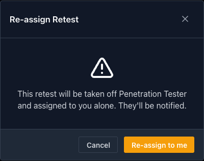
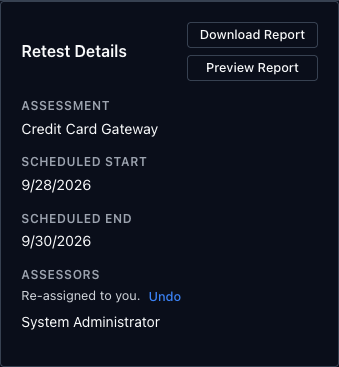
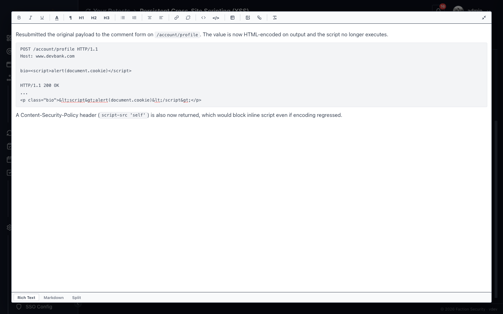
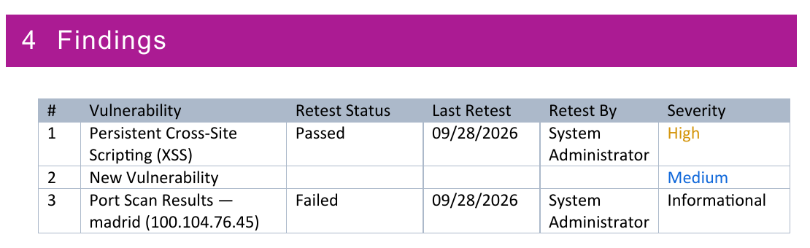
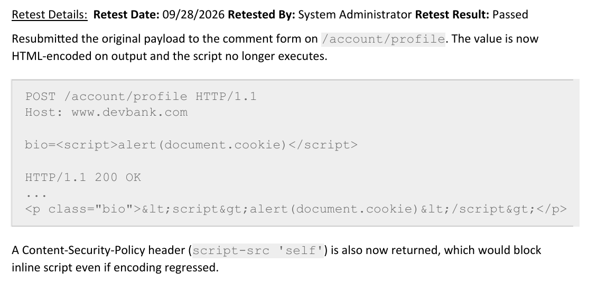
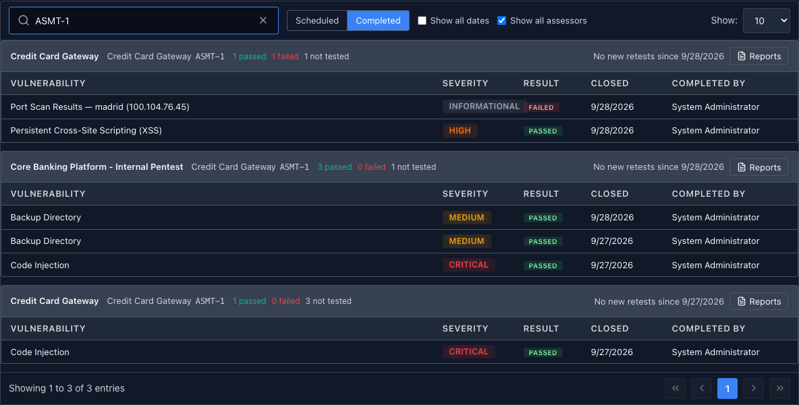
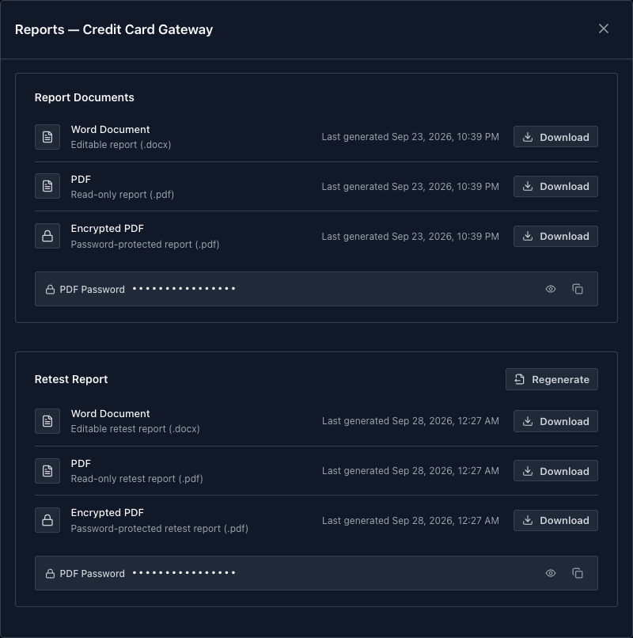
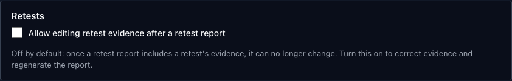

# Retest findings and send the retest report

Once the client has fixed what the report found, a retest checks each fix. In Faction every finding is retested on its own, with its own evidence and a pass or fail result, and the **retest report** rolls the results for one assessment into a document for the client.

This walkthrough follows two findings from the [first report](../getting-started/first-report.md) through a retest: one fixed, one not.

## 1. Add a retest template

The retest report is built from a second DOCX on the assessment's report template. In **Admin → Content & Reporting → Report Designer**, select the template and upload the document under **Retest Template** with **Upload Retest Template**.

The retest template shares everything else with the main template: CSS, font, sections, fields and finding colors. It can use every report variable, plus four that carry each finding's retest result. See [Retest reports](docx-templates.md#retest-reports) for the variables and an example layout.

Without a retest template, the retest steps below still work; only generating the retest report is unavailable.

## 2. Schedule the retests

Retests run on a completed assessment. Open **Remediation → Vulnerabilities**, tick the findings to retest and click **Schedule Retest**. Pick a **Start Date**, an **End Date** and one or more **Assessors**, then click **Schedule Retests**. Each finding gets its own retest.

The assessors see them under **Your Retests** on the **Scheduled** tab.

**Show all assessors** lists everyone's retests, not just yours, limited to the assessments your role lets you see. Search matches the vulnerability, assessment and assessor.

### Taking over a retest

To pick up a retest that was assigned to someone else, open it and click **Re-assign to me** next to **Assessors**. Faction asks first, because the retest moves to you alone and the previous assessors are notified.

Until you leave the page, **Undo** hands it back:

**Re-assign to me** is only offered on a scheduled or in-progress retest, to someone who can edit the assessment.

## 3. Record the evidence and the result

Open the retest from **Your Retests**. The **Complete Retest** panel has three parts.

- **Evidence** is what goes to the client: the request you replayed, the response, screenshots. It is printed in the retest report, as the label says.
- **Result** is **Pass** or **Fail**. A pass asks **What does this close?** when your workflow tracks remediation stages, for example closed in development, staging or production.
- **Comment** is for your team only and is not included in the retest report.

The evidence box is small in the side panel. Click the expand icon at the right of its toolbar to write in the full window, and press Esc to shrink it back:

**Save** keeps your draft. **Save & Close** records the result and moves the finding to **Passed Retest** or **Failed Retest**.

Evidence belongs to the retest, not the finding, so a finding retested several times keeps every round's evidence. The retest page lists earlier retests of the same finding under **Retest History**.

## 4. Generate the retest report

When you complete a retest and the assessment has results that aren't in a retest report yet, a banner offers to generate one:

Click **Generate retest report**. Generation runs in the background and takes a few seconds; the banner then offers the downloads, and the password for the encrypted PDF:

**Later** hides the banner. The assessment stays ready, and you can generate from the **Completed** tab or the assessment's **Finalize** tab instead.

The report lists every finding on the assessment, not just the ones retested this round, so the client sees what is open and what is closed. Each finding carries its latest retest's result, date, tester and evidence. A finding that was never retested shows them blank.

One retest report is kept per assessment. Generating again replaces it.

!!! note "The evidence is locked once it is in a report"
    Generating the retest report locks the evidence it used, so what the client received can't change underneath them. See [Correcting evidence after a report](#correcting-evidence-after-a-report).

## 5. Find it again later

The **Completed** tab on **Your Retests** groups finished retests by assessment.

- Each assessment's bar shows the application and its app ID, how many retests passed and failed, and how many of the assessment's findings have **not tested** yet.
- **Generate** appears on an assessment with results that aren't in a retest report yet. Otherwise the bar reads **No new retests since** and the date of the last retest report.
- **Show all dates** includes retests older than 30 days, and **Show all assessors** includes other people's.
- Search matches the assessment name, application name, app ID and vulnerability name.

**Reports** opens every report for that assessment in one place: the assessment report and the retest report, with their downloads and the PDF password. **Regenerate** builds the retest report again.

The same **Retest Report** section appears on the assessment's **Finalize** tab, under **Report Documents**. It works on a completed assessment, where the main report can no longer be regenerated.

## Correcting evidence after a report

By default, evidence that a retest report has used can't be edited, and the retest page shows when it went out. If your team needs to correct it and reissue the report, turn on **Allow editing retest evidence after a retest report** for the assessment's workflow under **Admin → System → Assessment Config → Workflows**:

With it on, editing locked evidence marks the assessment ready again, so the correction goes out in a new retest report rather than drifting from what the client holds.

## Where to go next

- **Design the retest report.** [Retest reports](docx-templates.md#retest-reports) lists the retest variables and shows a layout that prints the result and evidence for each finding.
- **Track the fixes.** [Track Vulnerabilities and SLAs](../solutions/vulnerability-management-sla.md) covers remediation stages and SLA tracking between the report and the retest.
