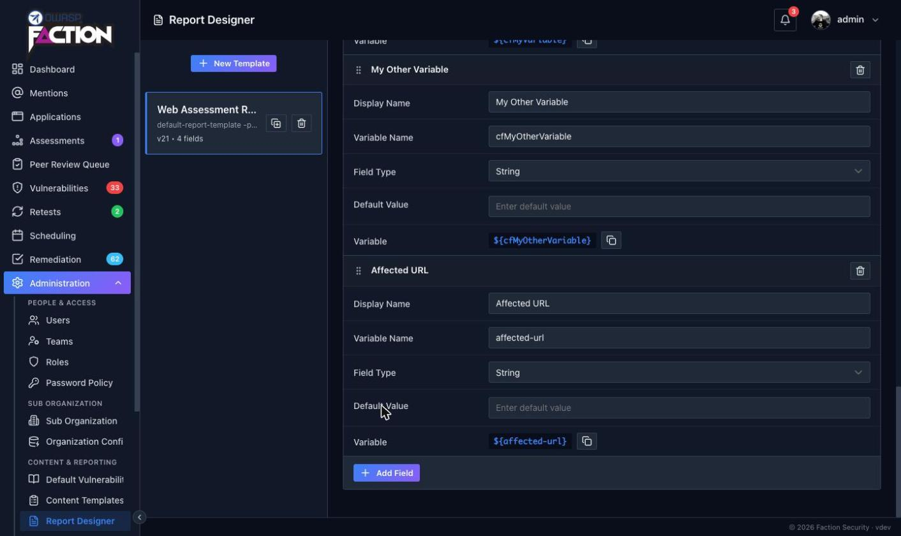
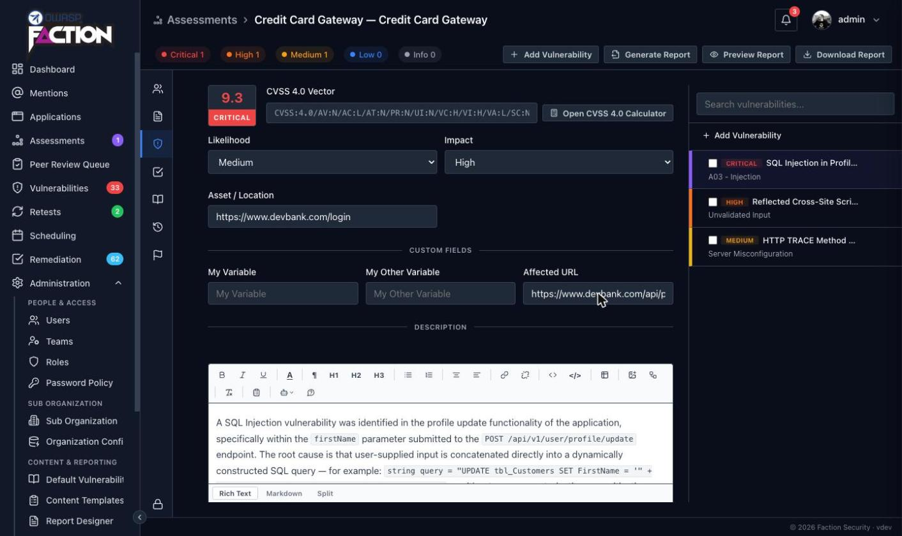
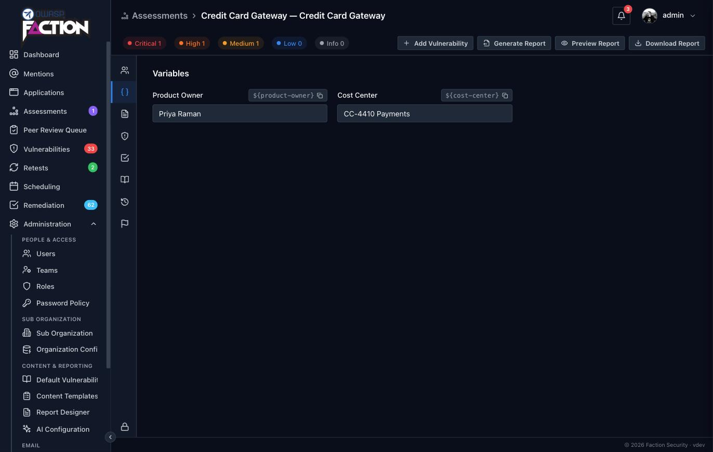
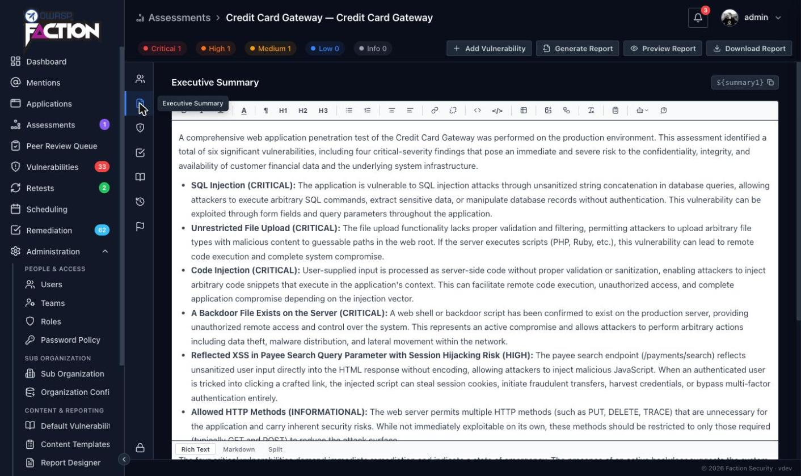

# User Defined Fields

User defined fields add information to Faction that it does not track out of the box. Use them to capture extra details on each finding, such as an affected URL or a CWE number, or to collect report-level content such as an executive summary, a product owner or a cost centre. Every field gets a `${variable}` you can drop straight into the DOCX template.

In Faction 2 these fields belong to a **report template**, and a report template belongs to an **assessment type**. That is what makes them assessment-specific: a Web Application template can carry an "Affected URL" field while a Network Security template carries "Affected Network Range", and each assessment only ever sees the fields of its own template.

## Step 1: Add the field in the Report Designer

Navigate to **Admin → Content & Reporting → Report Designer** and select the template. Near the bottom of the page are two panels:

- **User Defined Fields — Assessments** holds fields that are filled in once per assessment. Each Rich Text field gets its own tab on the assessment; the String and Dropdown fields are grouped together on a separate tab.
- **User Defined Fields — Vulnerabilities** holds fields that are filled in on every finding. They appear under **Custom Fields** on the finding form.

Click **Add Field** in the panel you want, then fill in the card:



| Setting | What it does |
|---|---|
| **Display Name** | The label assessors see in the UI |
| **Variable Name** | The name used in the DOCX template. It is generated from the display name (lower-cased, spaces become hyphens, anything else stripped) but you can change it |
| **Field Type** | **String** for a single line of text, **Dropdown** for a fixed list of options, **Rich Text** for formatted content with headings, lists, links and images |
| **Default Value** | Pre-filled when the assessment or finding is created |
| **Options** | Dropdown only: one option per line |
| **Variable** | The finished `${…}` token, with a copy button |

The template saves as you type. Drag the handle on the left of a card to reorder fields; the order here is the order assessors see.

In this example we added **Affected URL** to the Vulnerabilities panel, which produced the variable `${affected-url}`, and two String fields, **Product Owner** and **Cost Center**, to the Assessments panel, which produced `${product-owner}` and `${cost-center}`.

!!! warning "Changing a variable name"
    Values assessors have already entered are matched to the field by its variable name. Renaming the variable on a template that assessments are already using disconnects those values, so the field comes back empty on every existing assessment and finding. Change the display name freely; change the variable name only on a template nothing uses yet.

## Step 2: Use the variable in the report template

Add the variable wherever you want the value to appear in the DOCX. A vulnerability field goes inside the findings table or the `${fiBegin}` … `${fiEnd}` block, an assessment field can go anywhere.

If the value is a URL, append `link` to turn it into a hyperlink. Put the variable in a hyperlink in Word; the address you give it there is a placeholder and is replaced with the value at generation time. [See Hyperlinks](docx-templates.md#hyperlinks).

```
Affected URL: ${affected-url link}
```

Rich Text fields are rendered as formatted content and can be styled from the template's CSS: each one is wrapped in a `div` whose class is the variable name.

## Step 3: Fill in the field

**Vulnerability fields** appear under **Custom Fields** on every finding of an assessment that uses the template:



**Assessment fields** are filled in on the assessment itself, from the tab strip on the left of the assessment page.

String and Dropdown fields are combined on one **Variables** tab, the `{ }` icon in the strip. Each field shows its `${…}` variable next to the label with a copy button. Here the template has two String fields, **Product Owner** and **Cost Center**:



Each Rich Text field gets a tab of its own, named after the field, with the variable shown in the top right:



Once the report is generated, the values take the place of the variables.

## Templates change, assessments keep their values

An assessment takes a copy of the template's fields when it is created. When the template changes later, the assessment picks up the changes the next time it is opened: new fields appear, renamed display names and changed options are updated, and fields removed from the template disappear along with their values. Values already entered are kept as long as the variable name has not changed.

## Colouring values in the report

A String or Dropdown value can drive a colour in the report, for example a green cell for "Happy" and a red one for "Sad". This is done with the `${custom-fields}` variable in the template and is described under [Setting custom variable colours](docx-templates.md#setting-custom-variable-colours).

## Built-in fields

Every new template comes with two assessment fields, **Executive Summary** (`${summary1}`) and **Scope** (`${summary2}`), which the sample report templates already reference. They are ordinary user defined fields and can be renamed or removed like any other.
