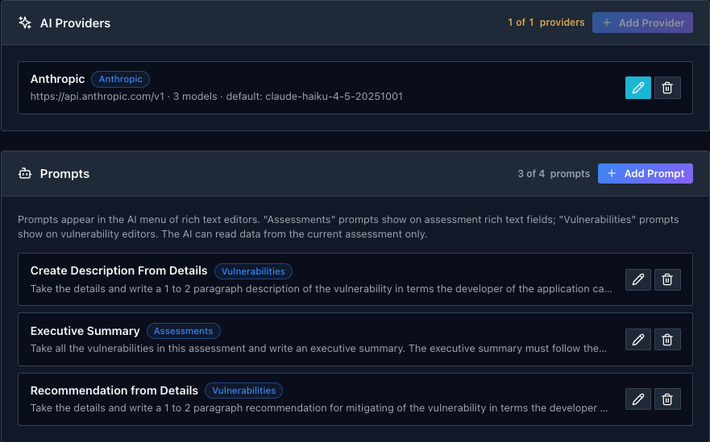
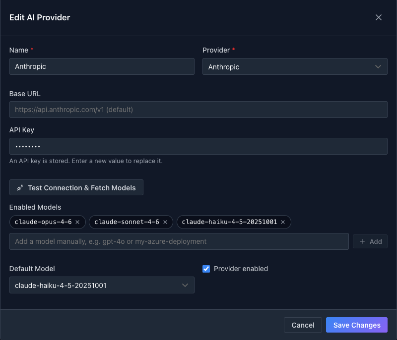
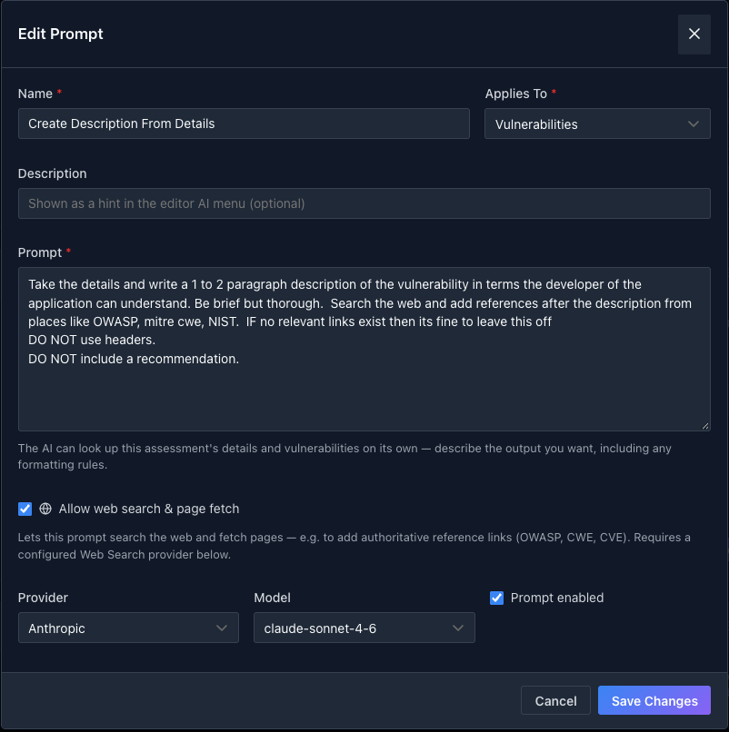
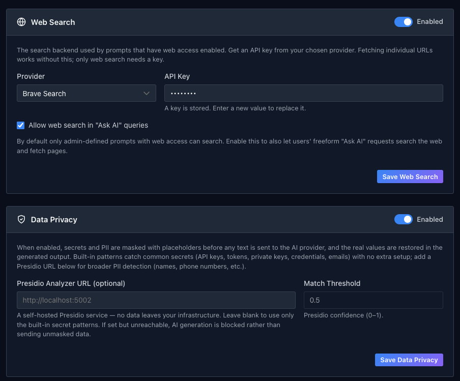

# AI Configuration

<div class="video-embed">
<iframe src="https://www.youtube-nocookie.com/embed/d4nGdZvRSFE" title="Faction 2 AI prompts" frameborder="0" allow="accelerometer; autoplay; clipboard-write; encrypted-media; gyroscope; picture-in-picture; web-share" referrerpolicy="strict-origin-when-cross-origin" allowfullscreen></iframe>
</div>

Everything the AI features do is configured on one page: **Admin → Content & Reporting → AI Configuration**. It has four parts, top to bottom: the model providers Faction can call, the prompts that appear in editors, the web search backend, and data privacy.

## AI providers



A provider is an account with a model vendor. Click **Add Provider**, or the pencil on an existing one, to open the form.



| Field | What it does |
|---|---|
| **Name** | How the provider is labelled in prompt settings, for example "Anthropic" or "OpenAI (production)" |
| **Provider** | **OpenAI**, **Anthropic**, **OpenRouter**, **Azure OpenAI** or **OpenAI-Compatible**. The last two need a **Base URL**; Azure also takes an **API Version** |
| **API Key** | Stored encrypted. Once saved it is shown masked, and entering a new value replaces it |
| **Test Connection & Fetch Models** | Checks the key and pulls the list of models the account can use |
| **Enabled Models** | The models prompts are allowed to pick from. Add from the fetched list, or type a model or deployment name by hand |
| **Default Model** | Used by any prompt that does not pin its own model |
| **Provider enabled** | Untick to keep the configuration but stop prompts using it |

Once a provider is saved and enabled the AI buttons appear on editor toolbars.

## Prompts

Prompts are the entries in the editor's **AI prompts** menu. Faction ships with three, which are the ones the video walks through:

| Prompt | Applies to | What it does |
|---|---|---|
| **Create Description From Details** | Vulnerabilities | Writes a one to two paragraph description from the finding's details, then searches the web for OWASP, CWE and NIST references |
| **Recommendation from Details** | Vulnerabilities | Writes a one to two paragraph recommendation from the details |
| **Executive Summary** | Assessments | Writes an overview, a severity-ordered list of every finding, and prioritised remediation paragraphs |

Click **Add Prompt** or the pencil on an existing one to edit it.



| Field | What it does |
|---|---|
| **Name** | The entry in the editor's AI menu |
| **Applies To** | **Assessments** prompts appear on assessment editors such as the executive summary; **Vulnerabilities** prompts appear on a finding's Description, Recommendation and Details |
| **Description** | An optional hint shown under the name in the menu |
| **Prompt** | The instruction sent to the model |
| **Allow web search & page fetch** | Lets this prompt search the web and read pages, for reference links. Needs a web search provider below |
| **Provider** and **Model** | Pin this prompt to a specific provider or model, or leave both at the default |
| **Prompt enabled** | Untick to hide the prompt from editors without deleting it |

### Writing prompts

The model can look up the assessment and its vulnerabilities on its own, so the prompt does not need to say where the data is. Describe the output you want and the rules it must follow. The shipped description prompt is a good pattern:

```
Take the details and write a 1 to 2 paragraph description of the vulnerability
in terms the developer of the application can understand. Be brief but thorough.
Search the web and add references after the description from places like OWASP,
mitre cwe, NIST. If no relevant links exist then it's fine to leave this off.
DO NOT use headers.
DO NOT include a recommendation.
```

Things worth being explicit about, because models will otherwise guess:

- **Which field to read from.** "Take the details" makes the prompt work from the steps to reproduce, not from a description that may not exist yet.
- **Length and shape.** One paragraph or two, a bulleted list or prose, what order.
- **No headings.** A heading in generated text lands in the report as a heading and breaks the template's flow.
- **What to leave out.** Models like to add a recommendation to a description or a summary to a recommendation. Say no.
- **References.** If you want links, say where from, and say what to do when there are none so it does not invent them.

The executive summary prompt shows the same approach applied to structure:

```
Take all the vulnerabilities in this assessment and write an executive summary.
The executive summary must follow these steps.
1. Open with a one-paragraph overview of the assessment and number of findings.
2. Create a bulleted list that summarises each finding with 1-2 sentences.
   Start with highest severity and end with the lowest.
3. End with 1-2 paragraphs that prioritize how these should be remediated.
DO NOT use headers.
```

### Choosing a model per prompt

Each prompt can pin its own model, and the shipped ones do: the description prompt, which searches the web and writes the most, uses a larger model, while the recommendation and executive summary prompts use a smaller, faster one. Move a prompt to a bigger model when you are not happy with its output, and to a smaller one when you are happy and want it cheaper and quicker.

## Web search



Prompts with **Allow web search & page fetch** ticked can search the web and read the pages they find. Fetching a page needs no setup; searching needs an API key from one of the supported backends, **Brave Search**, **Tavily** or **Serper**. Pick the provider, paste the key and click **Save Web Search**.

By default only administrator-written prompts can search. Tick **Allow web search in "Ask AI" queries** to let assessors' free-form requests search too.

Page fetches are made by the Faction server on the model's behalf, so they are restricted to http and https, follow no redirects, and refuse any address that resolves to a private, loopback or link-local network.

## Data privacy

When **Data Privacy** is enabled, secrets and personal data are masked with placeholders before any text is sent to a provider, and the real values are put back in the generated output. The built-in patterns catch API keys, tokens, private keys, credentials and email addresses with no extra setup.

For broader detection, names, phone numbers and the like, point **Presidio Analyzer URL** at a self-hosted [Microsoft Presidio](https://microsoft.github.io/presidio/) instance and set the **Match Threshold**, the minimum confidence at which a match is masked. Nothing is sent to Presidio outside your own infrastructure. If a Presidio URL is set but the service cannot be reached, AI generation is blocked rather than sending unmasked text.
