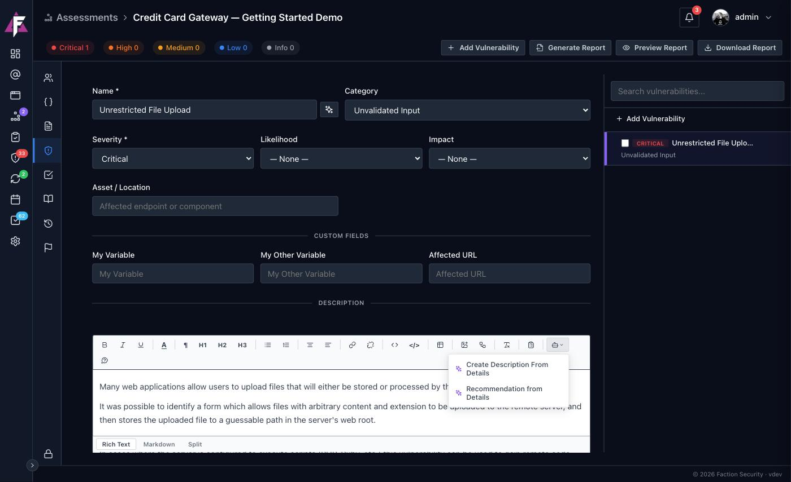
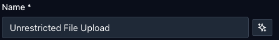
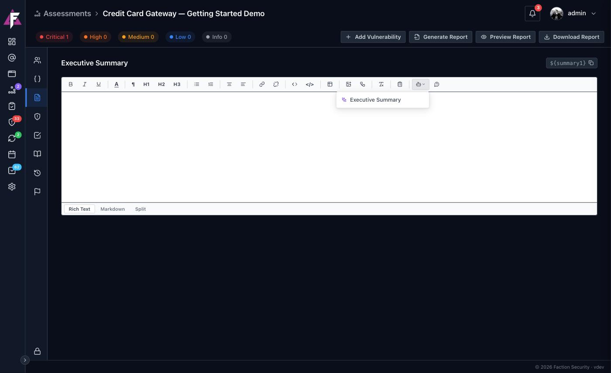
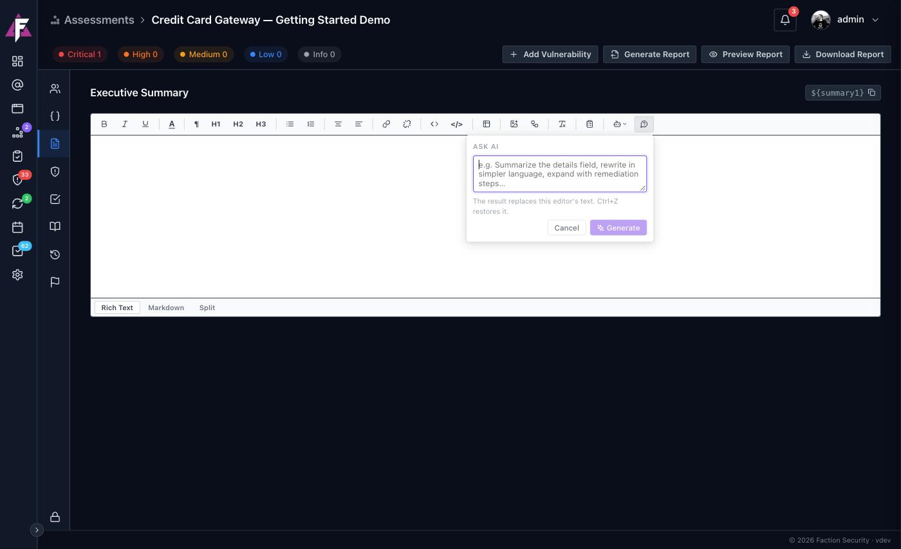

# AI Content Generation

<iframe src="https://www.youtube-nocookie.com/embed/d4nGdZvRSFE" title="Faction 2 AI prompts" frameborder="0" allow="accelerometer; autoplay; clipboard-write; encrypted-media; gyroscope; picture-in-picture; web-share" referrerpolicy="strict-origin-when-cross-origin" allowfullscreen></iframe>

Faction can write the parts of a report that follow from evidence you have already collected: the description and recommendation for a finding, the executive summary for an assessment, a title for a vulnerability. It does this with prompts an administrator writes once, so the output comes out in your voice, your structure and your length every time, and with a free-form **Ask AI** box for everything else.

The model is never handed a blank page. Every request runs against the assessment you are working in, and the model can read that assessment's details and its vulnerabilities through a set of internal tools. It cannot see any other assessment.

This page is the written version of the walkthrough in the video above. Setting up a provider and writing prompts is covered in [AI Configuration](ai-configuration.md).

## The workflow

When you are testing, you are not thinking about descriptions and recommendations. You are finding things and jotting down how you got there. Faction's prompts are built around that: capture the steps to reproduce while the context is fresh, and let the prompts turn those steps into the report text.

### 1. Write the steps to reproduce

Open the finding and put what you found into **Details**. Screenshots, request and response snippets, the exact parameter, what you saw. This is the only writing the workflow needs from you.

### 2. Generate the description from the details

In the **Description** editor, open the **AI prompts** menu on the toolbar and choose **Create Description From Details**.

The result is not a generic paragraph about cross-site scripting. It is a description of the issue you actually found, written from your details, in terms the developer can act on. The shipped prompt also has web access, so it searches for and appends references from OWASP, MITRE CWE and NIST where they exist.

### 3. Generate the recommendation

In the **Recommendation** editor, open the same menu and choose **Recommendation from Details**. This prompt reads the details rather than the description, so the advice is grounded in what you observed. It has no web access and comes back in a second or two.

### 4. Let it name the finding

Next to the **Name** field is a **Suggest a title with AI** button. It reads the description and details and proposes a title, which you can accept or edit.

### 5. Write the executive summary

With the findings in, open the assessment's **Executive Summary** tab, open the **AI prompts** menu and choose **Executive Summary**.

The shipped prompt asks for a one-paragraph overview of the assessment and its number of findings, a bulleted summary of each finding from highest severity to lowest, and one or two closing paragraphs that prioritise remediation. Because the prompt runs against the whole assessment, every finding is included without you listing them.

From there, generate and preview the report as described in [Getting Started](../getting-started/first-report.md).

## Ask AI

The **Ask AI** button on any editor toolbar takes a one-off instruction instead of a saved prompt.

Type what you want, for example "summarise the details field", "rewrite this in simpler language" or "expand this with remediation steps", and click **Generate**. The result replaces the editor's text; **Ctrl+Z** restores what was there. Ask AI has the same view of the assessment as a saved prompt, so it can pull in other fields and other findings on request. Whether it may search the web is an [administrator setting](ai-configuration.md#web-search).

## What the model can see

Every prompt and every Ask AI request is scoped to the current assessment on the server. The model is given tools to look up the assessment's details and its vulnerabilities, and those tools are filtered to that one assessment: it cannot name another assessment, and nothing outside the one you are in is reachable. Web search and page fetching are only available to prompts an administrator has allowed them for.

If **Data Privacy** is enabled in the AI configuration, secrets and personal data in the text are replaced with placeholders before anything is sent to the provider and restored in the generated output, so an API key pasted into a details field never leaves your server.

## Adjusting the output

Everything about the generated text is set by the prompt: its length, its tone, whether it uses headings, whether it adds references, which model writes it. If the result is not how your team writes, change the prompt rather than editing every result. See [Writing prompts](ai-configuration.md#writing-prompts).
