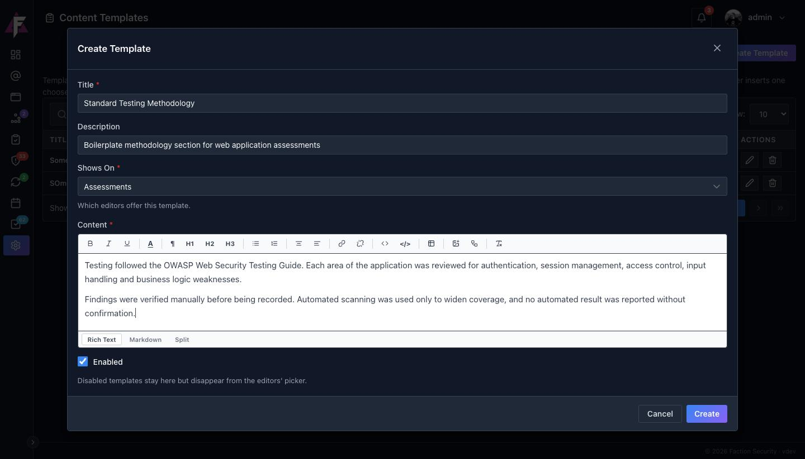
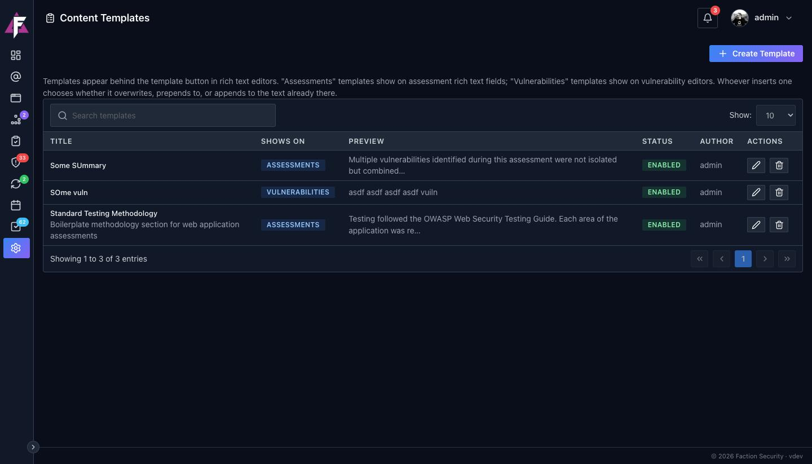
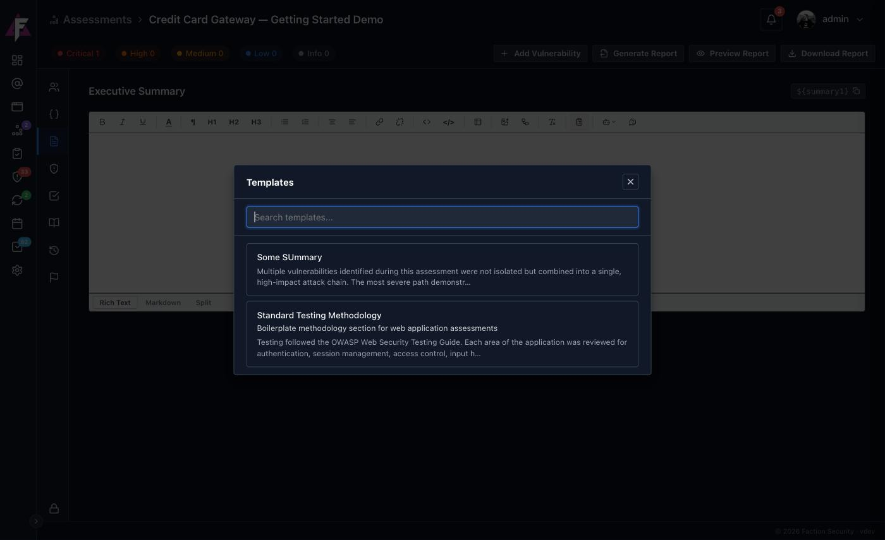
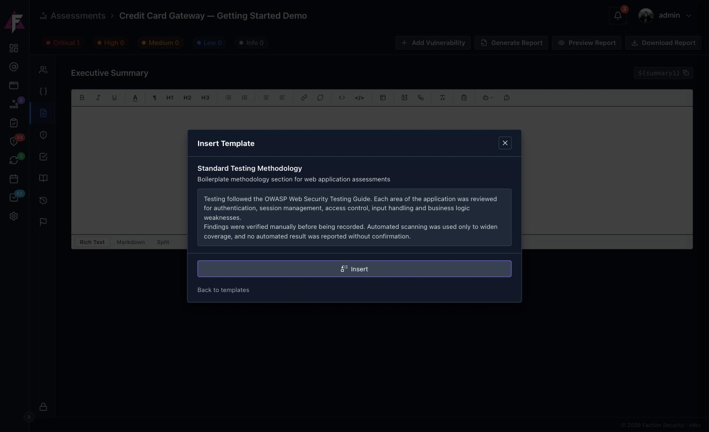

# Content Templates

A content template is a block of saved text that assessors insert into a rich text editor. Use it for anything that reads the same on every engagement: the methodology section, a scope preamble, a standard disclaimer, the fixed part of a finding write-up. Write it once under Admin, and it is one click away in every editor it applies to.

## Creating a template

Navigate to **Admin → Content & Reporting → Content Templates** and click **Create Template**.

| Field | What it does |
|---|---|
| **Title** | The name assessors pick from the list |
| **Description** | One line shown under the title in the picker, to tell similar templates apart |
| **Shows On** | **Assessments** offers the template in assessment editors such as the executive summary and scope; **Vulnerabilities** offers it in a finding's Description, Recommendation and Details |
| **Content** | The boilerplate itself, in the same rich text editor assessors use, so headings, lists, tables and images all carry over exactly |
| **Enabled** | Untick to keep the template but hide it from the picker |

The list shows every template with its scope, a preview of its content, whether it is enabled and who wrote it.

## Using a template

In any editor the template applies to, click the **Insert a saved template** button on the toolbar. The picker lists the enabled templates for that scope, with a search box for when the list grows.

Pick a template and Faction shows its full content before anything is inserted:

When the editor already has text, the picker asks how the template should land:

- **Overwrite** replaces everything in the editor with the template.
- **Prepend** inserts the template above the existing text.
- **Append** inserts it below.

On an empty editor there is only **Insert**. Either way the template becomes ordinary editable text once it is in; changing the template later does not change text already inserted.

!!! tip "Templates and AI prompts work together"
    A template gives you the fixed wording, an [AI prompt](ai-content.md) gives you the engagement-specific part. A common pattern is a vulnerability template that lays out the section headings your reports use, followed by an AI prompt that fills each one in from the finding's details.
